# PROJECT VANGUARD: THE LONG DARK

**Retro OVA cel-shaded space combat for the web** — Three.js (WebGPU renderer,
TSL + hand-written WGSL, compute particles), TypeScript (strict), Vite. No
image or audio assets: every ship, sky, portrait, sound and note of music is
generated.

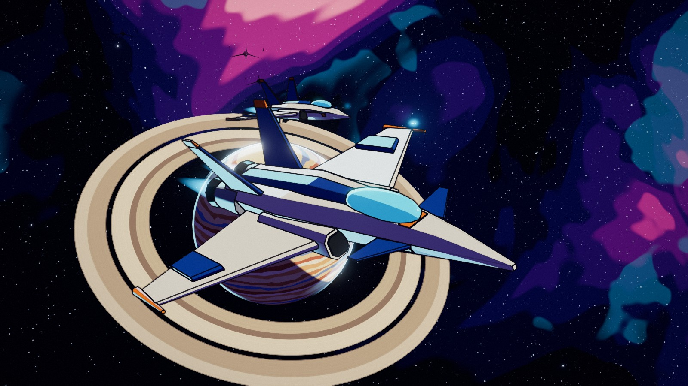

Four hundred years after the Shattering broke the galaxy's gate network,
the Terran Directorate and the Zenith Hegemony fight a slow war over
Ebon-gas — the black-light isotope that keeps six relit Lanterns burning.
You fly Vanguard, the squadron that goes through first. And beyond a gate
that leads nowhere, something is counting down the primes.

- Series bible: [docs/LORE.md](docs/LORE.md)
- Campaign (20 episodes, 4 chapters): [docs/CAMPAIGN.md](docs/CAMPAIGN.md)
- Milestones: [docs/ROADMAP.md](docs/ROADMAP.md)

## Running

```bash
npm install
npm run dev            # http://localhost:5173 — title card → campaign
npm run build          # typecheck + production bundle
npm test               # campaign runner + all 20 missions (node:test)
npm run ai-sim         # headless dogfight/formation/station sim with pass/fail numbers
npm run econ-sim       # trade-route balance on the seeded Reach (profit per hold, pass/fail bands)
npm run ai-sim         # headless dogfight/formation sim with pass/fail numbers
npm run balance        # headless combat balance: time-to-kill bands, pass/fail
npm run career-check   # headless career loop: profile → dock → contract → hires → shipyard → reload
npm run perf           # frame-time budgets (meaningful on real GPUs only; --no-demo --query … for A/B)

npm run perf           # frame-time budgets (meaningful on real GPUs only)
npm run attract-check  # title attract loop soak (prologue ↔ trailer): GPU objects / heap / DOM flat
npm run shot -- --jpg --shot 'hero:cam=0&t=3'   # headless screenshots
```

Needs a WebGPU browser (Chrome/Edge 113+, Safari 26+, Firefox 141+). WebGL2
still runs (TSL ink twin), but compute particles are disabled there.

## Controls

| | |
|---|---|
| Mouse / arrows | steer (virtual stick) · gamepad supported |
| Q / E | roll |
| W / S · X | throttle · kill throttle |
| Shift | afterburner |
| J | cruise drive (3 km/s) |
| Z | flight assist on/off (Newtonian) |
| Space / LMB | guns |
| R | next gun (e.g. Kestrel: pulse laser ↔ autocannon) |
| F / RMB | missile salvo (needs lock) |
| Y | next missile type (micro swarm · heavy torpedo · harpoon) |
| T | next target |
| B · Shift+B | next · previous subsystem on the target (turrets, lances, hangars, engines, shield generator, bridge): exposed ones first |
| I / MMB | the target's subsystem nearest the crosshair |
| 1–4 | wing orders: form up · attack my target (and your selected subsystem) · engage at will · cover me |
| Tab | tactical view (battle at ¼ speed) |
| V · K | camera shots · cinematic auto-cutaways |
| M | star map (click a system to plot a route) |
| H | hail the ship under your nose (name, flag, route, manifest) |
| U | turret discipline on outfitted hulls: FREE (any hostile in arc) → MY TARGET → HOLD |
| G | request docking within 5 km of a station / friendly carrier; below an orbital port, the landing corridor to its surface port (again to cancel) |
| L | codex / archive |
| N | mute |
| F3 | dev panel (perf graph, latency) · F1–F6 G-buffer views |
| F10 | photo mode: freeze, free orbit (drag / arrows, wheel or [ ], Q/E roll), **P** / F12 save PNG, Esc resume |

## Docking & trade

Every system has 1–3 stations (seeded): Lantern refineries, fossil-salvage
yards, military bastions, free ports and orbital ports with a landing
tether down to the planet; friendly carriers dock at their bow hangar. Press
**G** within 5 km (no hostiles within 10 km, standing above −50), fly the
ILS corridor, and guidance takes the ship under 1 km (OVA cutaway, iris to
the berth). Docked: buy/sell eight commodities (prices from station type,
faction, slow drift and your own market pressure), repair, rearm missile
rails, read the rumour ticker, launch (**Enter**). Keys on the dock screen:
↑↓ select · →/B buy · ←/V sell · Shift ×5 · R repair · E rearm. Shares,
cargo, standing and rails persist in localStorage. Captures:
`?scene=flight&dock=approach|auto|docked|launch[&station=<id>][&cargo=demo]`.
Pure economy + tests: `src/game/economy.ts`, `tests/economy.test.ts`.

Bays are real hollow recesses (collar, dark liners, frame ribs, deck lights
running inward, a lit berth door) behind a faint atmosphere curtain that
ripples where the ship crosses it; the auto-dock cuts from a tracking shot
to the mouth to the inside of the bay. Wingmen break off to hold points
outside the corridor while you dock and re-form when you launch. Campaign
episodes lock docking out unless the mission sets `allowDocking`.

**Every hull size docks.** The berth follows the hull (`src/world/berths/`):
fighters (≤ 40 m) fly into the hangar bay as above; gunships and corvettes
(40–200 m) are clamped alongside one of two **gantries** on every station — a
lattice boom out of the hub, a tower, and a swing arm on its own joint that
swings out square and clamps the flank while umbilicals reach across; frigates
(> 200 m) **moor** off a long pylon past the ring, riding on a lit tether while
a lighter ferries the crew (the dock header shows a lighter pictogram). Friendly
carriers take fighters in the hangar and corvettes **alongside** on a tether
(riding the carrier's velocity); frigates are turned away. The approach scales
with length (`approachProfile`): guidance reaches out further (1 km for a
Kestrel, 1.6 km for the Resolute, 2.5 km for the Valiant), the capture window
widens (bounded), a closing-speed cap has to be met (≈190 m/s for a corvette,
≈155 m/s for a frigate), the corridor gates spread out and the final is a
slower cubic ease; the hull swings round on the way in so it berths nose out.
Cutaways frame the whole hull (tracking quarter, planted outboard of the berth, high over
the arm or tether, a wide orbit berthed) and each class has its own undock:
lines drop and the arm swings home / the tether reels in, then the drive
lights. Gantries and pylons are blueprint parts, so they get collision proxies
and AI avoidance like the rest of the station (`tests/berths.test.ts` puts a
Bulwark, a Resolute and a Valiant at every berth of every station kind and
checks hull and corridor clearance). Captures:
`?scene=flight&dock=auto|berth|launch&own=gs12-bulwark|cr5-resolute|ffl3-valiant[&dockt=S]`.

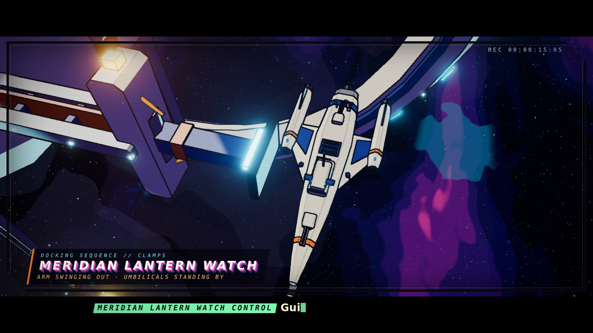
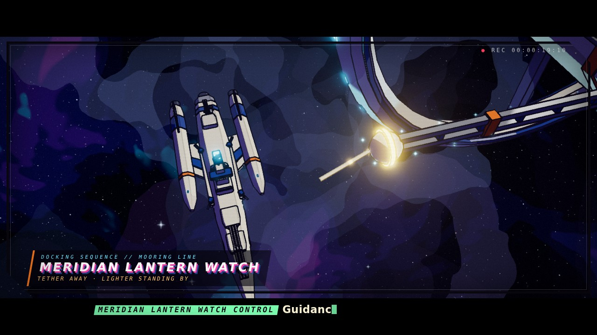

**Planetary ports.** Every orbital port's tether comes down to a city: a
surface port per inhabited world (seeded, `src/universe/surfacePorts.ts`; key
worlds are named — Castellan Low City floats in the gas giant's upper bands,
The Spire stands on the Hesper shelf-sea). Below an orbital port, **G**
requests the **landing corridor**; fly down beside the tether and guidance
takes the ship at the entry gate ~2 km above the air. No load screen: entry
(nose down the tether, a cel plasma sheath over the nose, shake, the planet's
atmosphere colour filling the frame) → the cloud deck (cel cloud cards streaming
past, whiteout) → under the whiteout the flight scene swaps the world root for a
local, kilometre-scale **surface scene** (`src/world/surface/`): a stepped sky
from the planet's air, the cloud deck overhead, ground painted with the planet's
own palette (terrain, shelf-sea, dunes and mesas, ice, lava cracks, or a banded
cloud sea under a floating platform for a gas giant), and a spaceport city —
apron, pads sized by hull class with chasing rim lights, the tether foot and the
cable climbing into the clouds, control tower, hangars, instanced city blocks
with lit window bands and beacons, circling traffic. A long descending glide at
the city, hover, straight down onto the pad, and the dock screen: surface ports
are their own station kind (`surface`: food, medicine and luxuries in demand,
foundry spares and charges cheap) with a market, concourse, shipyard and
outfitting. Launch reverses it: lift-off, climb-out into the deck, whiteout, and
up the tether out of the air. Captures:
`?scene=flight&descent=corridor|entry|clouds|below|glide|final|pad|docked|liftoff|climb|orbit[&port=<id>][&dockt=S]`.

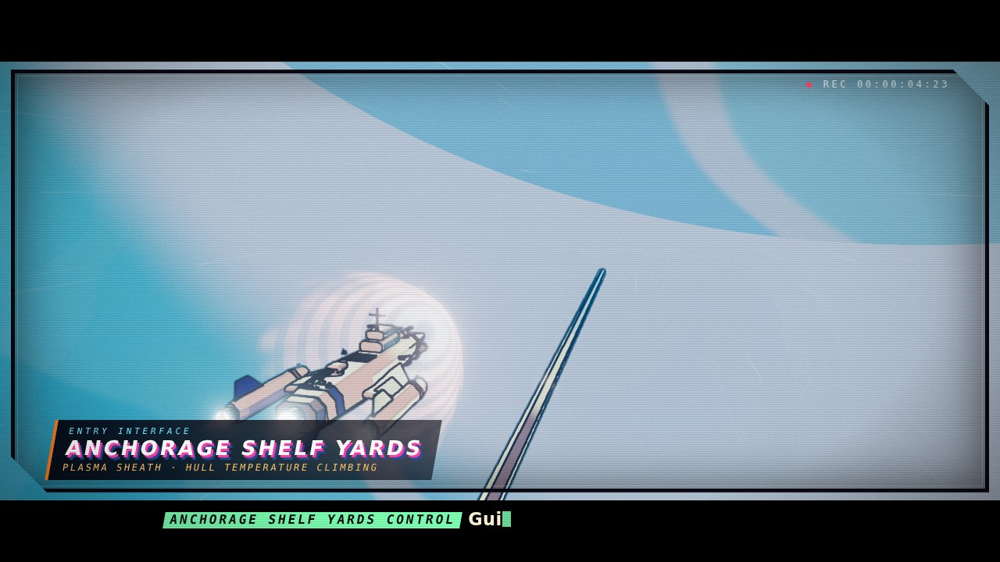
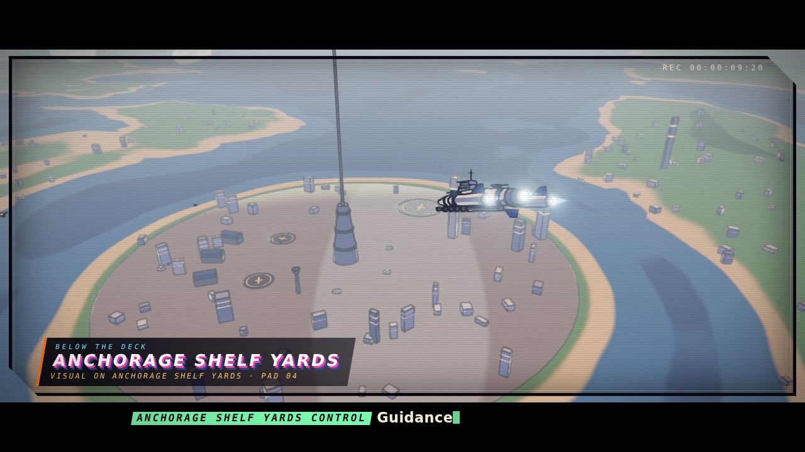
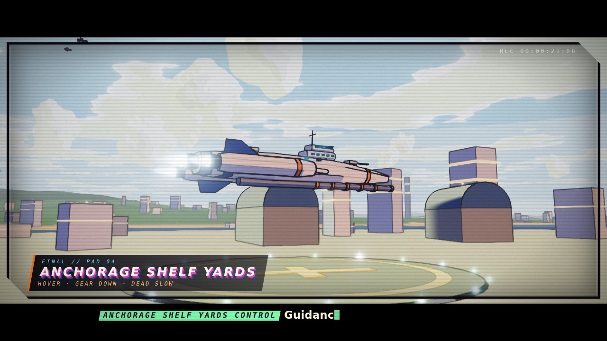

**Balance.** A safe run earns about 1.5–4k sh a hold (a fresh pilot's first
run, capital-bound, ~1k); the fat margins (up to ~8k) are in contested and
Hegemony space and the Null Lantern's shadow, where markets pay hazard
premiums. Per-commodity pressure means a hold of one good sells badly —
mix the hold. `npm run econ-sim` prints the best routes and asserts the
bands (`src/game/econSim.ts`, `tests/econ-sim.test.ts`); surface ports are in
the scan (a tether run from highport to city is ~1–1.5k a hold).

**Collisions.** Hulls are solid: fighters are spheres, stations and capital
ships get a few dozen proxy boxes / cylinders / rings built from their
blueprint parts (spinning rings ride their joint). Hits bounce and scrape
(damage from closing speed, sparks, camera shake); fast movers are swept
so nothing tunnels at cruise. AI avoidance steers round the same proxies
(`src/sim/Collision.ts`, `src/sim/CollisionProxies.ts`,
`src/world/HullCollisions.ts`, `tests/collision.test.ts`).

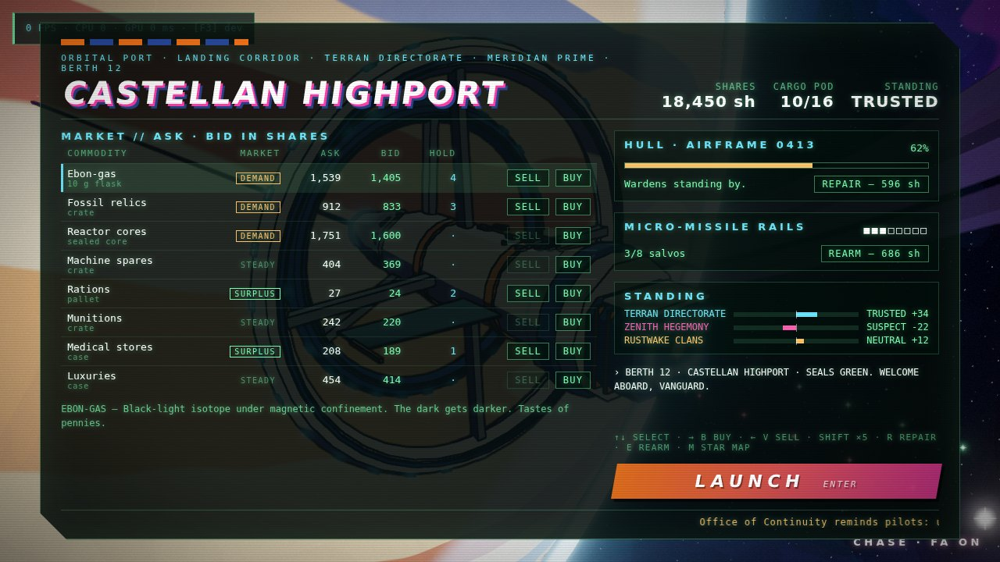

## Contracts & free flight

Between episodes the Reach stays open. After a debrief (or **CONTINUE — FREE
FLIGHT** on the title) you start berthed at a Directorate station; the next
episode is posted as **PRIORITY ORDERS** on every Directorate board, so the
story continues when you choose (the star map lists it; **P** on the map plots
the nearest Directorate berth).

Docked, tab **2 · CONTRACTS** is the station's board: seeded per station, 10
minutes of free flight per repost, reseeded as your standing climbs and
matched to your ship's tier. Eight kinds, each with a named client (comms
portrait) and an OVA mission-brief card:

| Kind | Work | Paid at | Tier I fee |
|---|---|---|---|
| Courier | sealed case to a station by a deadline (tier ≥ II: interceptors at the far end) | consignee | 520 + 460/jump |
| Cargo haul | 2–12 units loaded into your pod here, delivered there (sell one and it's theft) | consignee | 380 + 340/jump + 10 % of cargo value |
| Escort | see a freighter down a lane to a Lantern or station through 1–2 raids | client | 1,500 |
| Bounty | find a named raider in the wrecks and kill them (and their wing) | client | 2,300 + 300/jump |
| Patrol sweep | fly 3–4 nav points in order, clear what's hiding | client | 1,350 + 280/jump |
| Salvage recovery | survey a wreck or golden-age hulk (dwell), recover its flight core, get clear | client | 1,650 + 300/jump |
| Reconnaissance | hold an observation point in a dangerous system, then break contact | client | 1,900 + 320/jump |
| Faction sortie (rare) | join a Directorate picket flight against a Choir Measure | client | 5,200 + 300/jump |

Tier II ×1.75, tier III ×2.8; standing moves fees −12 %…+25 %. Late or
abandoned jobs cost 30 % of the fee and twice the standing. Up to 5 at once.
Accepted work in the current system runs through the campaign runner
alongside normal flight (objective panel top-right, orange nav diamonds,
**C** tracks the next job and plots its route on the star map); fees are paid
on docking. Keys on the tab: ↑↓ · **A** accept · **D** decline · **T** turn
in · **X** abandon. Pure + tested: `src/game/contracts/`,
`tests/contracts.test.ts`. Captures:
`?scene=flight&contract=<kind>&cphase=board|op|pay|map`.

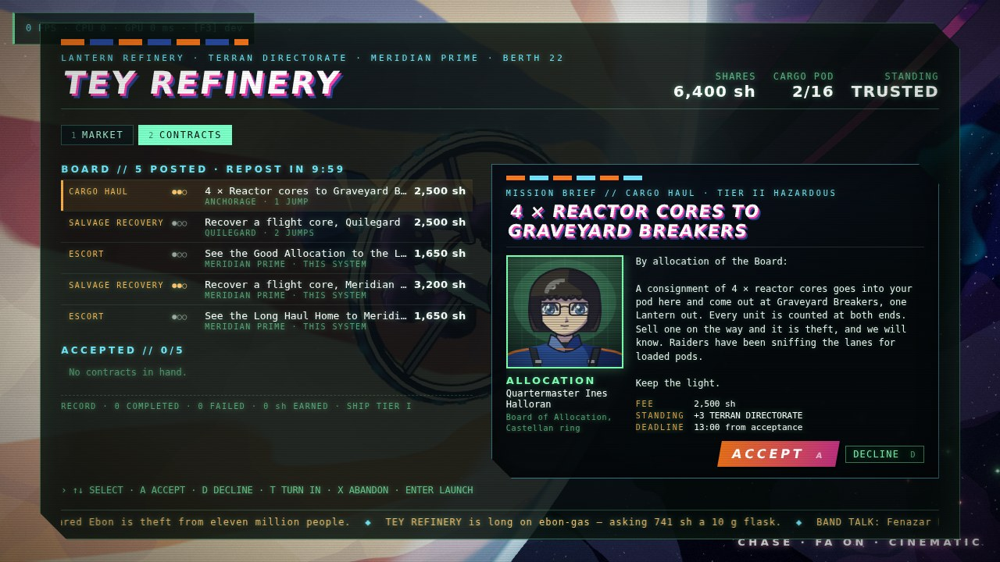
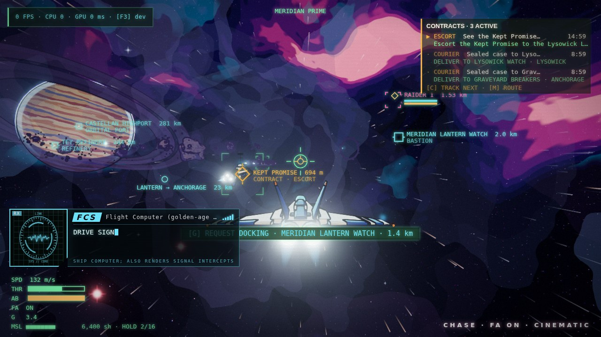

## People, voices & subtitles

**Voices.** Every speaking character has a procedural voice (`src/audio/voice`):
a planner turns the line into syllables and phoneme-ish segments — vowels as
formant targets, consonants as frication / bursts / nasals, a phrase melody
that falls, rises on questions and sings the Hymn in prime intervals — and a
small Web Audio graph (glottal pulse → formant bank + noise) renders it
through a radio band + squelch for comms, a room for people in person, or a
warm hall for the prologue narrator. It is English *shaped*, not English:
OVA radio chatter in an invented cadence, and it renders offline
(`node scripts/audio-render.mjs --only voice-radio,voice-prologue`). Cast
voices are hand-tuned; everyone else gets a stable voice from a seed.
Optional real speech (Web Speech API) with per-character voice picks.

**Subtitles.** One timing model (`src/ui/subtitleTiming.ts`: ≤ 15 chars/s,
hold covers the voice, lines never overlap) drives the comms panel, the
prologue's captions (now voiced by a narrator keyed to them), station
conversations and cutscenes; the typewriter follows the voice. Optional
Japanese second line where the script has one.

**Settings (anywhere):** **F7** voice synth / speech / off · **F8** subtitle
size S / M / L / off · **F9** Japanese line on/off. URL: `?voice=`, `?subs=0`,
`?subsize=l`, `?jp=0`.

**Concourse.** A dock tab (`src/ui/Concourse.ts`, key 2) with the 2–4 people
at the station: fourteen recurring named people who travel the Reach on
their own schedules (a bartender whose bar moves with her, a Graveyard
breaker, an engine-warden on circuit, a Tey of *that* Tey, a grounded Cantor,
a Continuity auditor, a refugee with a letter…) and locals who rotate with
the play clock. Conversations are data (`src/dialog/conversations.ts`) run by
a pure engine (`src/dialog/engine.ts`, `tests/dialog.test.ts`): conditions on
flags / standing / shares / cargo / episode; effects that trade, move
standing, unlock the codex, fill a notebook of rumours and trade tips, and
offer contracts or hires through `dialogHooks`. Several change as the
campaign advances. Captures:
`?scene=flight&dock=docked&docktab=concourse&talk=odile&talkpath=0`.

**Barks.** In flight, wingmen call splashes, hits, missiles and losses;
Cantors taunt on the open band; passing traffic hails — all voiced,
subtitled and rate-limited (`src/dialog/barks.ts`, `FlightRadio.ts`;
`?radio=0` for a quiet HUD; `?bark=<kind>` fires one for captures). Station
control talks you down the docking corridor in the cutaway's letterbox.
Listen: [docs/audio/voice-radio.wav](docs/audio/voice-radio.wav) ·
[docs/audio/voice-prologue-opening.wav](docs/audio/voice-prologue-opening.wav).

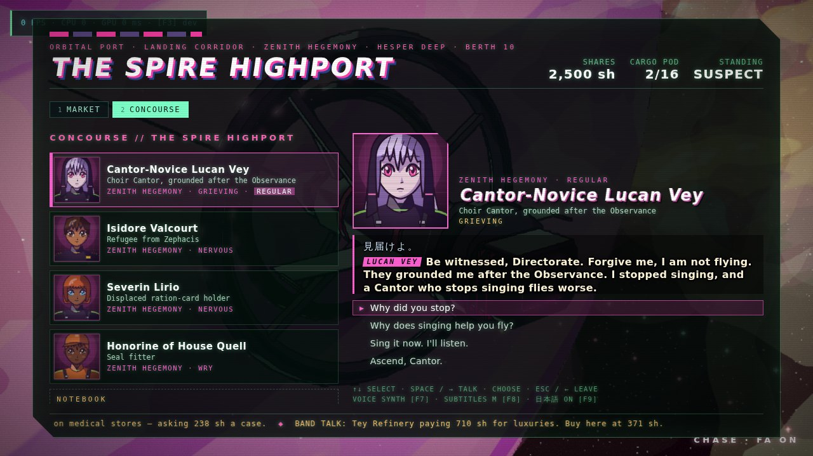

## Threads & rivals

The Reach keeps living while you fly elsewhere. Both systems are pure data +
functions over the shared world memory (`src/game/world/WorldState.ts`:
facts `npc.<id>.*`, events in the log), wired in by `src/game/npc/live.ts`.

**NPC arcs** (`src/game/npc/arcs.ts`, writing in `arcData.ts`,
`tests/npc-arcs.test.ts`). Seven recurring people have multi-step stories:
Odile's bar moves after the Bastion falls and needs a stake and her DELAYED
board; Magpie's forty-gram clan debt is bought by Ninefingers Crane; Pell
Varga re-audits the Schedule and needs a courier, then a witness; Nadia reads
refugee lists station by station for her brother; Toma Kerrigan cracks under
the Signal and takes a Kestrel out to answer it; Class Four's school tender
loses its escort; Warden-Sister Maud wants to break the Sixth Keeping to ask a
failing reactor why. Each step puts its person on a particular concourse
(the arc overrides their usual wandering), has a status line, a voiced and
subtitled conversation and often a named job (`arcContracts.ts`, flown by
the ordinary contracts runtime). Steps move on world facts (your choices,
your jobs' outcomes, story flags) or on elapsed play time — arcs catch up any
number of steps at once while you're away, so ignored stories end without
you: well, badly, or missed. The **THREADS** dock tab (`src/ui/ThreadsTab.ts`)
lists open and closed threads with last-known whereabouts and the job on
offer.

**Rivals** (`src/game/rivals/rivals.ts`, `RivalDirector.ts`,
`tests/rivals.test.ts`). Six named aces and bounty marks — Red Sabine (paints
her kills on the hull), Ninefingers Crane (bought Magpie's paper), Unwitnessed
Ismene (a Cantor who stopped singing), Corporal Skerry (deserted the Null
picket), the Metronome (a Choir ace who counts your hits) and Vosk, the
Knife (Continuity's interceptor). Each has a face and voice, a hull + wing +
AI personality per tier, hunting grounds, a wake condition and a grudge meter
fed by what you do (wingmen killed, ambushes broken, bounties taken, beating
them). With cooldowns (per rival and global) they intercept on lanes or lead
Rustwake traffic ambushes, taunt on the open band, break off below a third of
their hull and come back upgraded — until their mortal tier, where going down
is for good. Ismene and Skerry go to ground on a concourse after their first
beating and can be talked onto your wing (Lucan's song; Kerrigan coming home).

**Memory.** `src/game/npc/memory.ts` picks the most relevant event from the
world log and phrases it — *"You were at Halaedon when the Kittiwake
burned."*, *"You killed Tuck at Pelourin."*, *"You squared Magpie's paper."*
— for `{memory}` in NPC lines and rival grudge lines (events naming the
speaker first, then kinds they care about, then recency).

Captures: `?npc=odile:shut,magpie:hunted` (arc steps), `?rivalstate=ismene:hiding:4[:tier[:met]]`,
`?npcmemory=1` (seed a few remembered events), `?rival=<id>` (force an
intercept), `?docktab=threads`. World changes made in conversation are
recorded on the replay tape (`world` command); rivals and arcs ticking in
flight are part of the fixed-step sim and replay by themselves.

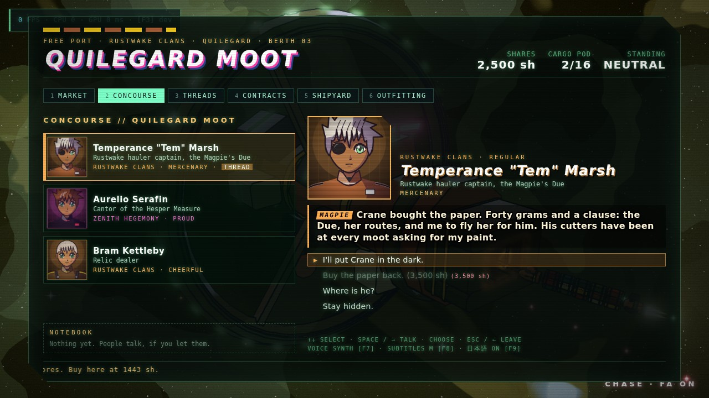
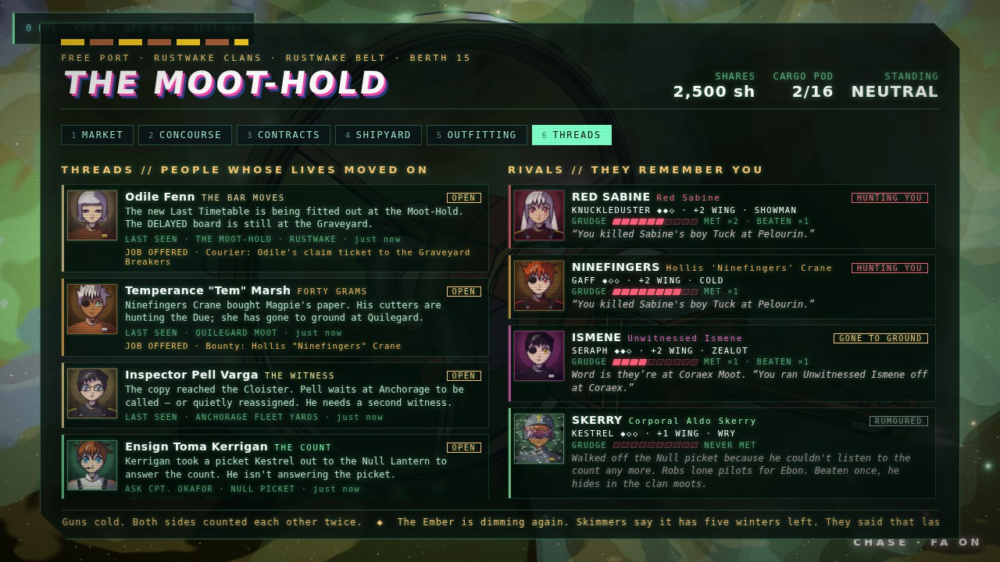
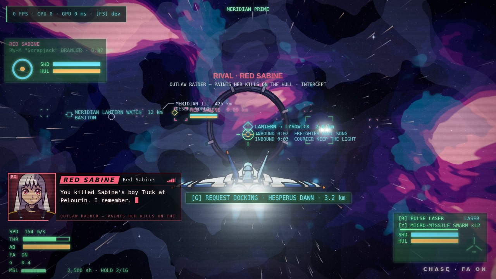
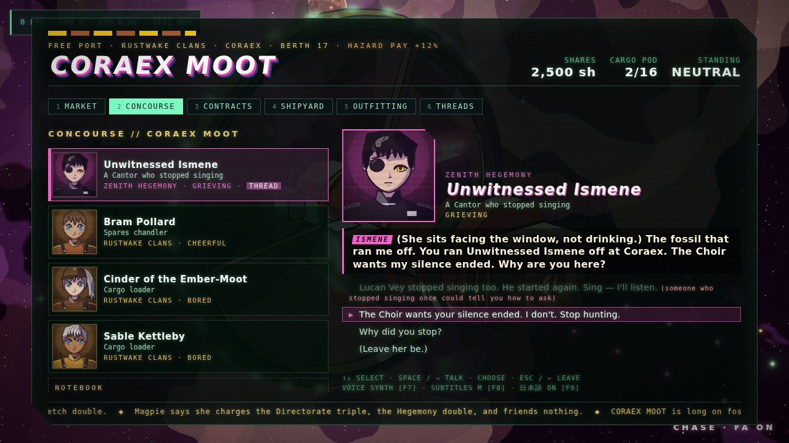

## The living Reach

**Planets.** Every system is surveyed on its own seeded stream *after* the
generator and station placement, so lanes, gates, stations and campaign
positions never move: original planets keep name, position, radius and ring
and gain a kind and a look; new planets, moons and landmarks are appended
well clear of everything. One painted shader (`src/world/planets/`) covers
banded gas / ice giants with great storms and ring shadow, height-ramp
terrestrial worlds (contour-band posterisation, Worley craters, caps, two-tone
cloud decks, cyclones), volcanic and burning worlds (glowing crack networks
and lava seas), Lantern-lit worlds (black-light veins) and night-side city
lights on inhabited worlds (from the station data). Landmarks: shattered
moons (tumbling chiselled fragments + rubble), burning worlds, Lantern-lit
worlds. Moons orbit slowly outside rings and station altitudes. Fly into a
ring plane and the disc becomes a place: a wrapping field of ice and rock
chunks thins with height and vanishes in the gaps. Every body has a name and
a line of flavour — on the star map survey panel and the HUD nav.

**Traffic.** Each system has a lane graph (Lanterns, stations, the belt) with
a timetable that is a pure function of the clock (`src/universe/traffic.ts`):
freighters, Ebon tankers, liners, couriers, miners, patrol wings of 2–4.
`src/world/Traffic.ts` materialises the sailings within 24 km (budget 22
ships, nearest first, parked past 32 km) and flies them with the same
FlightModel: slow off the node, lane cruise, slow approach, into a docking bay
or through a Lantern (jump flash; arrivals flash in on the timetable second).
Haulers are neutral (shoot one and it turns); patrols fly their flag and answer
distress calls and hostiles; Rustwake raiders ambush haulers in lawless and
border systems at a deterministic point on the lane — a distress call you can
fly to, with a bounty and standing when you break it. Hull choices are data
(`TRAFFIC_ROLES[role].hulls[flag]`, first id that exists), so civilian designs
drop in without code. Far ships ride the timetable (snapped every 8th frame),
mid-range ones steer every 3rd frame. The star map shows lane volume
(thickness, convoy dots), per-system traffic halos, raider warnings and a
survey panel. Captures: `?reach=body|ring|lane|ambush [&sys=<id>] [&body=<name|index>] [&side=lit|term|night]`,
`?traffic=0` for A/B.

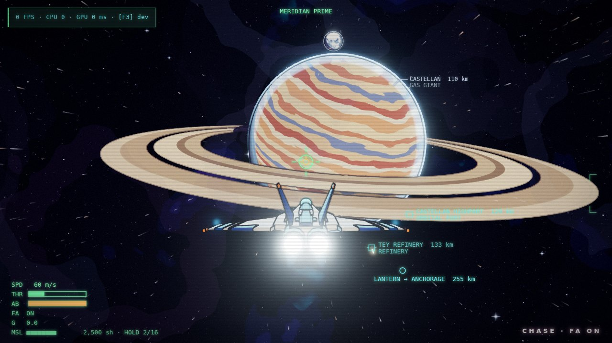
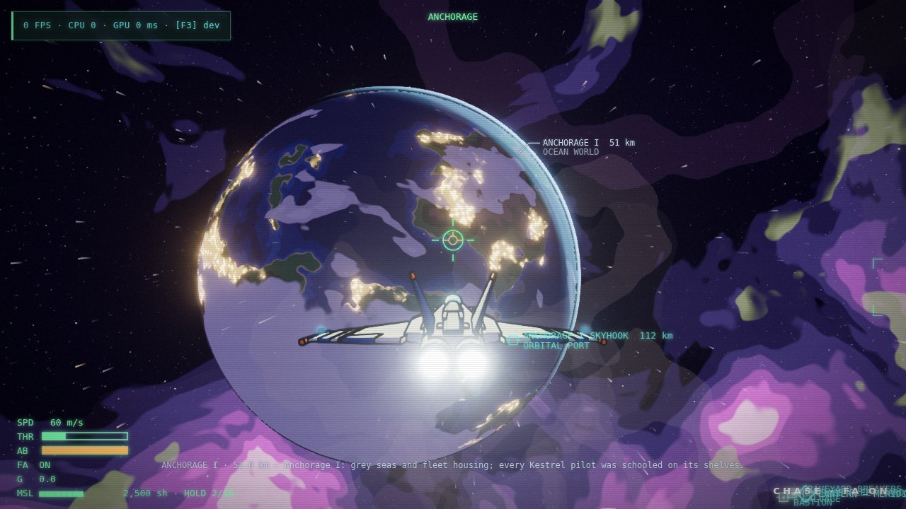
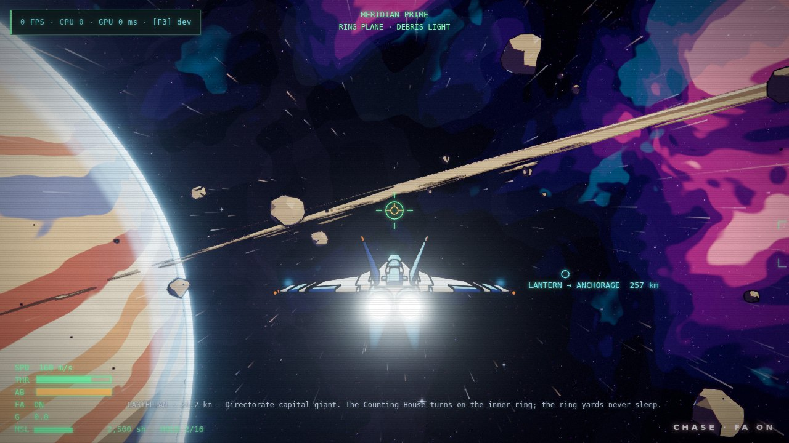
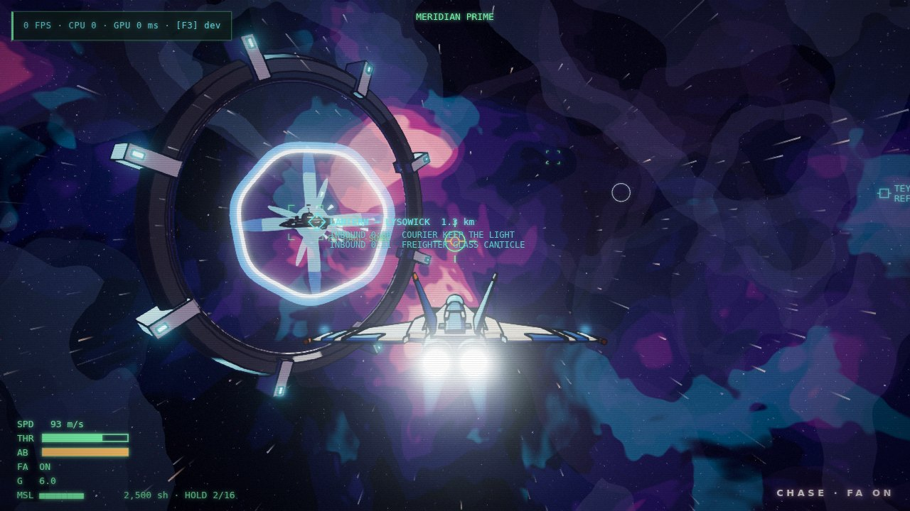
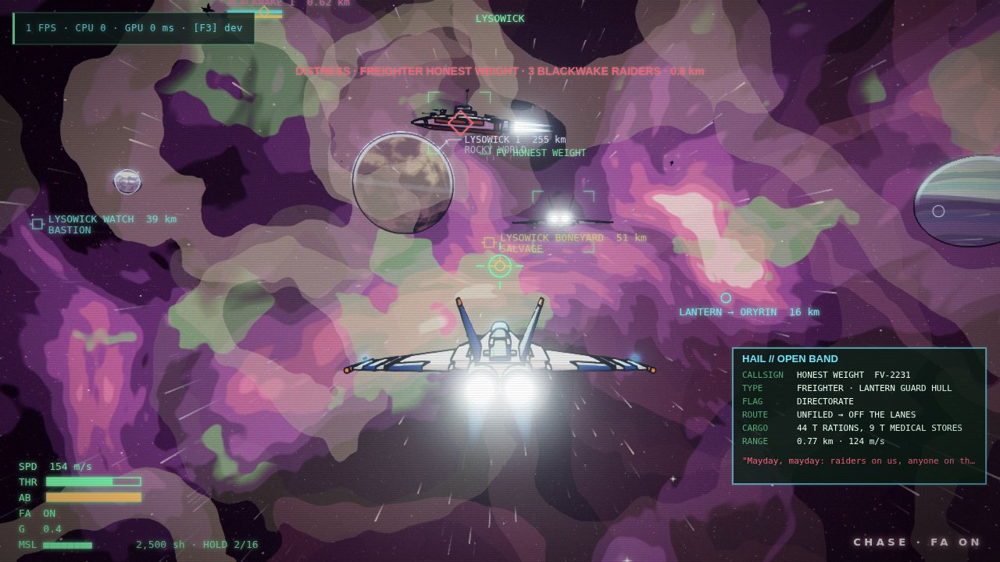
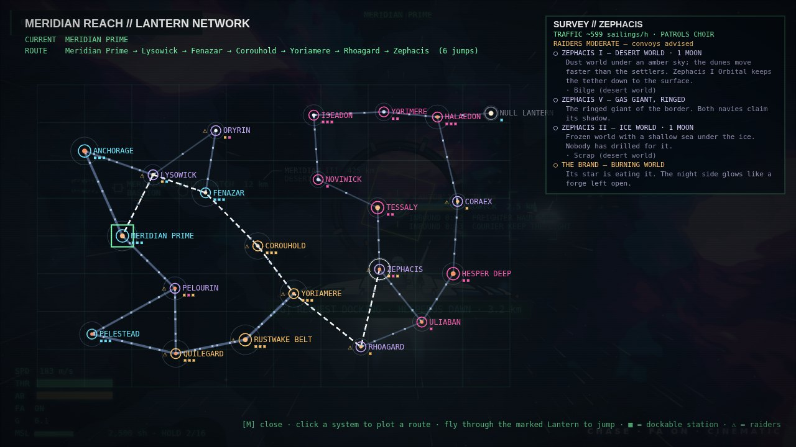

## A Reach that remembers

One shared memory, `src/game/world/WorldState.ts` (facts, counters, decaying
modifiers, an event log), and a pure simulation over it
(`src/game/world/sim.ts`, `step.ts`, `schedule.ts`, `signal.ts`, `news.ts`;
no Math.random — every roll hashes the Reach seed and a clock slot).

**Story → sandbox.** Every episode debriefed as a success writes
`story.ep<N>.done` and its chapter facts (`bastion.fallen`, `schism`,
`gates.aligned`, …). `STORY_RULES` turns completed episodes into *lasting*
modifiers derived at read time (never decayed, never washed out by a
nudge): the Fall of the Bastion puts refugee demand on Anchorage (rations
+28 %, medical +32 %, traffic +35 %, patrols thinned); the Schism contests
Tessaly's fields; after the Symphony of Gates Ebon collapses (refinery Ebon
−64 %, and the demand side further, so the old Ebon run pays nothing), relics
and luxuries rise and the Lantern toll (1 g of Ebon a jump) is gone. Old
careers are backfilled from the profile's episode.

**The pilot's deeds.** Breaking ambushes thins piracy and swells traffic in
that system for hours (three clean saves and the haulers call the run safe);
shooting a faction's ships brings patrols and cools its berths; every unit
traded leaves a price mark that outlives the 15-minute market pressure (a run
of eight makes the news); contracts paid warm the station. Background drift
rolls about four events an hour — convoys lost, refinery strikes, clan feuds,
Ember flares, relic finds, Allocation Hours, Observances, and, by chapter,
refugee convoys, joint squads, humming Lanterns — each a decaying modifier
and a line in the log.

**Readers.** Channels per scope (`system:<id>`, `system:*`, `station:<id>`,
`faction:<f>`, `guild:<id>`): `price:<commodity>`, `traffic`, `piracy`,
`patrol`, `attitude`. The economy (`setMarketWorld`: prices, tariffs from a
cold attitude, berth refusal at −0.8), the lanes (`setTrafficWorld`: sailings,
raid rate, patrol wings, rebuilt on system entry, the star map on opening),
contract boards (kind weights follow the lanes; fees ±15 % with attitude),
dock greetings, the ticker and the concourse (world headlines lead the
rumours; conversations can gate on `{ worldFact }`) all read through
`worldMod` / `sysMod` / `attitude`. With no world installed the Reach is the
batch-4 default, so `npm run econ-sim` bands still hold; it now also runs
three world scenarios with pass/fail: post-Episode 19 (Ebon collapses and
leaves the trade, safe holds still ~1,450 sh), post-Episode 10 (Anchorage
refugee demand) and a cleared lane (+45 % sailings, raids 0.20 → 0).

**The Schedule of Engagements** (after Episode 8): each quarter (40 min of
free flight) a seeded Schedule posts 3–5 engagements on the contested line,
the Treaty Line and the Null pickets — expected expenditure each side, Ebon
released to market, the 88 sh floor, a protected Hegemony "conductor". The
star map marks each field (crossed sabres, countdown) with a Schedule panel;
`[ ]` select, `O` takes one as ordered: a staged `sortie` op — take station
on the line, the Measure expends its quota, Allocation orders everyone home,
Continuity pays in shares. Or break it: kill the conductor or stay on the line
40 s after the order. Broken engagements are recorded (`schedule.broken.<id>`,
`continuity.hostile`): Ebon spikes +25 %, Continuity desks go cold (bastions
can refuse you), the news spreads, and next quarter's Schedule carries a
correction at the same field with the 13th requested by name. Unflown
engagements are fought as scheduled when their hour passes. The Schedule is
suspended when it is read aloud (Episode 18).

**The Signal.** A pure function of the story and the world clock: hidden
until Episode 5, pinned to each debrief's count (1,009 … 2), ticking one
prime down per 15 minutes of free flight but never to the next episode's
number; after Episode 12 its source is the Monolith, after 13 it shows the
Breath (56 days at 241), after 19 it stops at 2, after 20 it counts up.
Shown on the star map header, as a small violet counter in the HUD corner,
and on the title card once a career has heard it; every burst is a radio
intercept banner and a ticker line.

**Guild choices.** `FACT_RULES` read the arc finales the guilds write
(and NPC arcs / rivals read the story facts — `schedule.known`,
`signal.heard`, `bastion.fallen` — and log `ambush.*` / `contract.*`, which
the ticker reads):
a leaked Schedule (`schedule.leaked`) lifts Ebon 12 % and turns Continuity;
diverted grams (`anchorage.fed`) ease Anchorage's refugee demand; a sealed or
opened core, the Ember seam to Tey or the Breakers, and a defector
(`player.defected`: Directorate berths go cold, its patrols fly as renegades).

**One clock, replayable.** The world steps inside the flight scene's fixed
60 Hz `simStep` (free flight only) and is the Reach's single clock owner —
guilds, NPC arcs and rivals read `world().state.clock`; every roll
is a hash of seed and clock slot, so a replay rebuilds it bit for bit. Changes
made outside a tick go on the tape (`world-trade`, `world-take`,
`world-episode`); a dock trade shows its world mark beside the price (▲/▼).

Captures: `?world=ep<N>` fast-forwards the story (never saved)
`[&wclock=<s>] [&wbreak=1] [&wclear=<system>] [&wop=line|map]`.

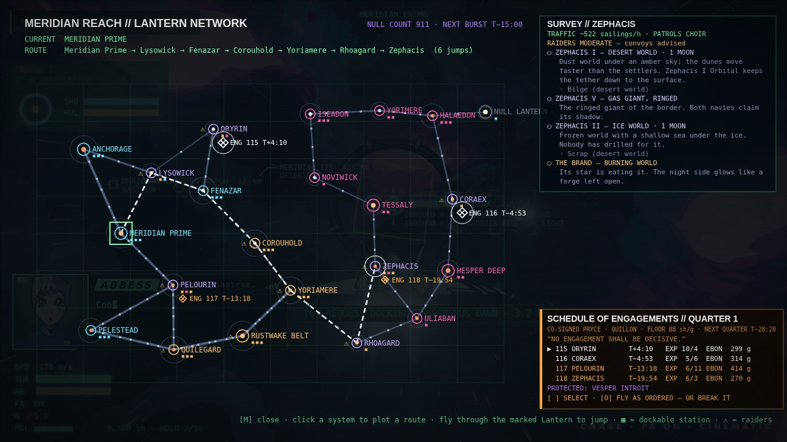
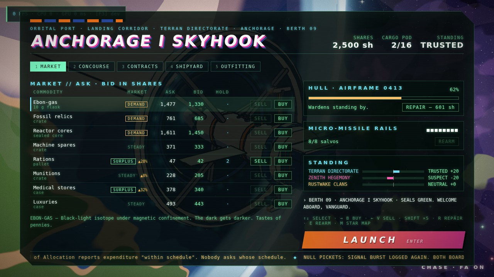
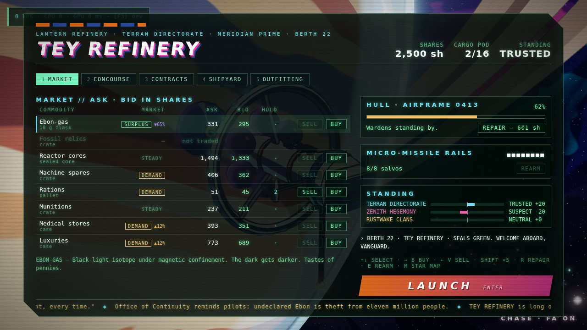
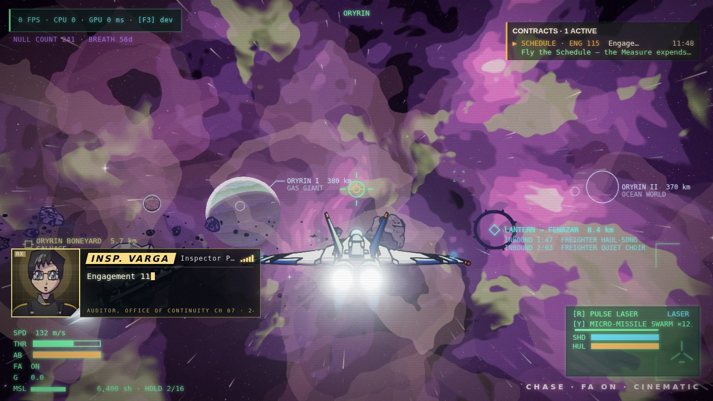

## Shipyard & outfitting

From a borrowed Kestrel to your own frigate. Docked, two more tabs:

**SHIPYARD** — your hangar (up to 6 hulls; owned ships are ferried with you, so
you can board any of them at any berth) and the hulls this yard sells:
Directorate bastions sell the whole line up to the T6 Valiant, orbital ports
up to T5 plus civilian hulls, refineries the small stuff, carriers fighters,
free ports Rustwake and civilian hulls; the catalogue's standing gates apply
(Resolute: Directorate +30, Valiant +60, Seraph: Hegemony +50). A rotating
cel model sheet of the selected hull (a software rasteriser on a 2D canvas:
the blueprint's real triangles, livery colours, three-tone cel light and an
ink silhouette), a stat comparison against the ship you fly, and the deal:
**B** buy with trade-in (60 % of the hull less damage, plus half the value of
its upgrades), **N** buy and keep, **A** board, **X** sell (twice).

**OUTFITTING** — the slots of the ship you fly, what this yard stocks for the
selected slot, stat deltas and a power bar. **↑↓** select, **←→** slots /
items, **B** buy & fit (the old item sells back at 50 %), **V** strip.

| Slot | Items (Mk I–IV from Directorate yards, Hegemony choir-forges, Rustwake salvage) |
|---|---|
| Guns S / M / L | S: PL/GU-11 twin mount (Kestrel), pulse laser, autocannon, hymn pulse, tine chord (hymn + lance), scattergun · M: GU-17 cannon pod, heavy pulse laser, beam-lance, flak cannon, scrap pair · L: heavy railgun, mass driver, great lance |
| Missile racks S / M / L | micro-missile rack, MCDF rail pair (swarm + torpedo), scrap rockets · swarm pod, harpoon launcher · heavy torpedo tube, psalm cell |
| Turrets S / M / L (assisted) | twin pulse, PD flak, scrap flak, hymn · heavy twin, heavy pulse, choir battery, lance, flak battery · triple rail, great lance, driver |
| Shield C1–5 | capacity / regen / delay (big hulls split it over four facings) |
| Armour C1–5 | hull ×, mass × (slower to accelerate and turn) |
| Drive C1–5 | speed / acceleration / turn |
| Reactor C1–5 | power output — every item draws MW; the fit can't exceed it |
| Utility bays | cargo extension, point-defence cluster, shield capacitor |
| Hangar bays (T6) | Kestrel / Gaff complement: launches when hostiles close, replaced on docking |

Makers have a house style: Directorate is the baseline; choir-forged items
are ~8 % better, draw 20 % more power, cost 35 % more and want Hegemony
standing; Rustwake salvage is 6 % worse, heavier and 28 % cheaper. Mk III and
Mk IV need standing with the maker's faction (Directorate +20 / +50) and
Mk IV is sold only at bastions and carriers. Guns and turrets fit a slot of
their size; racks their size or smaller; utility items their slot's class.
Utility numbers are ratios against the hull's stock (Mk I) item, so a stock
Kestrel is exactly the Kestrel the balance was tuned on, and every hull's
stock fit leaves ~20 % power headroom (all-Mk IV needs a better reactor).

A fit is applied to the live ship at spawn and after every refit
(`applyFit`: combat stats, damage pools, loadout with per-gun sockets / Mk
damage / barrels, missile specs, turret mounts, flight spec × drive and mass);
non-stock guns and racks get a pod on their socket and empty turret
barbettes are struck. Hull, fit and condition persist under their own key
(`vanguard.hangar.v1`; old saves start in a stock Kestrel); the hold follows
the ship. Story episodes are flown in a fighter: a bigger active hull stays
in the hangar and the fleet issues a Kestrel. Repairs scale with airframe
size. Contract boards match the hull's tier (T3–4 → II, T5–6 → III).

**Turrets fire.** Catalogue turret mounts on player hulls (and AI-flown
shipyard hulls) use the capital solver (`src/sim/ai/Turret.ts`: lead,
traverse and elevation limits by arc — dorsal / ventral full circle, bow and
aft 135°, broadside 108°) and train their barbettes toward the aim; flak
mounts break off for inbound torpedoes. Player turrets engage the selected
target when it is in arc, else (FREE) the best hostile they can reach. The
T6 Valiant is commanded from the bridge (bridge camera); chase distance
scales with hull length. Capital turrets now engage a player-flown capital.

**Corvettes bite.** The Lantern Guard and the Vesper carry dual-purpose
main batteries (`Loadout.battery`, `src/sim/Capitals.ts`): flak at fighters
and ordnance, heavy rounds at anything gunship-sized and up — the shield
breaker (Directorate heavy pulse / Choir hymn) while the facing in the way is
up, the hull breaker (cannon) once it is down. Point defence tracks at a
faster cadence with proximity-fused rounds, the Vesper carries a PD cluster
(she is an escort), and micro-missiles have hit points (one flak or laser
hit), so PD thins a swarm without stopping it.

**Balance** (`npm run balance`, scenario *outfit*: scripted helm at 1.5 km,
turrets live on both sides, mean of six seeds): a Mk III Resolute kills a
Lantern Guard solo in ~78 s with ~49 % hull left (bands 60–120 s, 30–80 %);
a stock one loses — refit before taking a picket alone. A Mk III Valiant
beats a Vesper in ~68 s with ~52 % hull left (bands 45–120 s, 30–80 %; stock
~88 s, 18 %), six of its seven torpedoes shot down. Scenario *swarm*: three
12-round swarms from 2.2 km — a Lantern Guard's PD takes ~25 %, a Mk III
Resolute's PD turrets ~8 %, the rest hit. Pure + tested:
`src/game/outfitting/{items,fit,hangar}.ts`, `tests/outfitting.test.ts`.
Captures: `?scene=flight&dock=docked&station=meridian-bastion-2&docktab=shipyard|outfitting[&own=<hull id>]`
(`&own=` gives you that hull, stock fit).

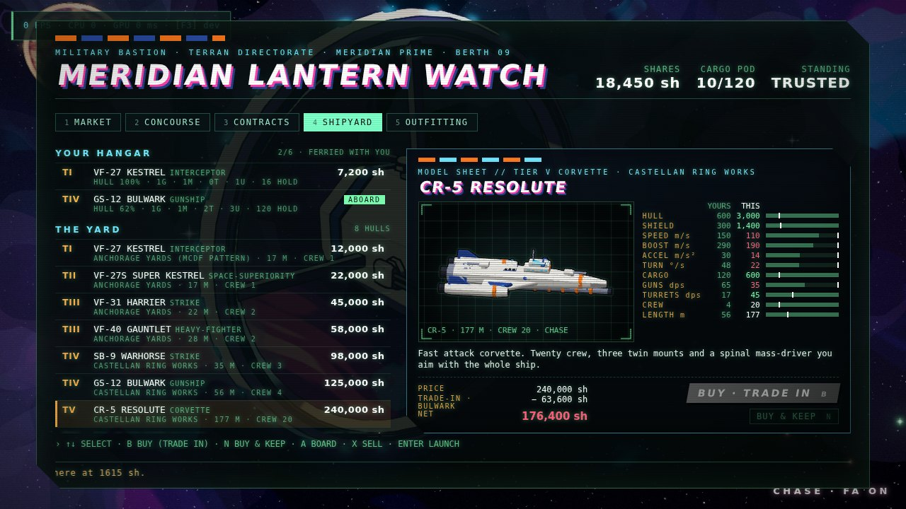
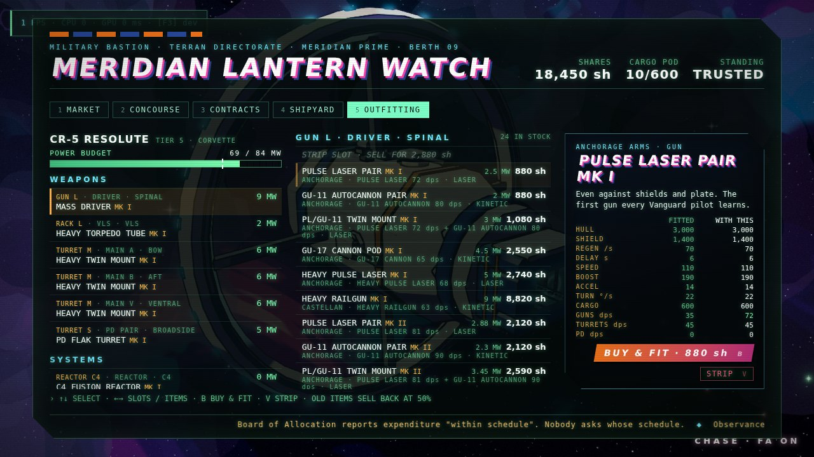
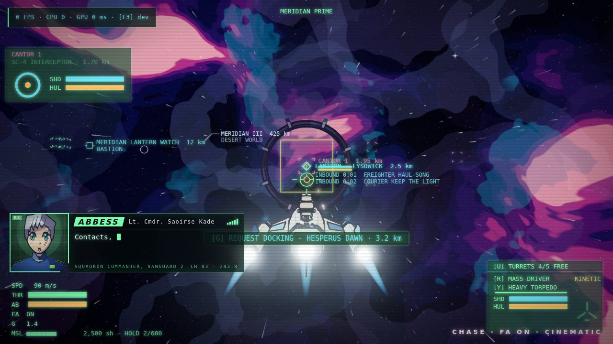
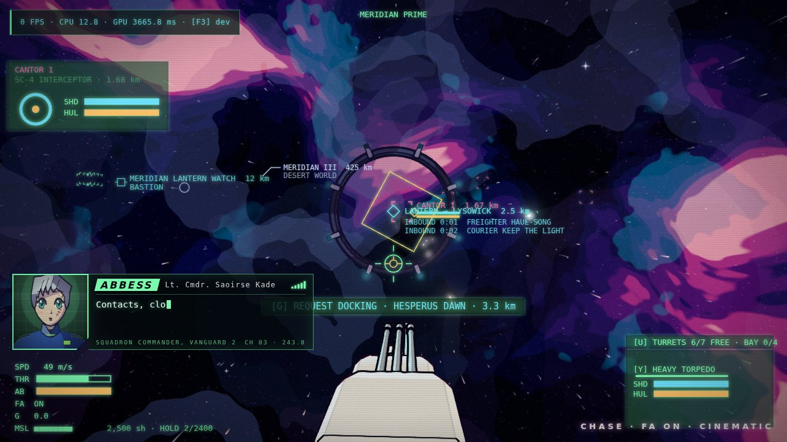

## Guilds, arcs & outposts

Five guilds out of the series bible keep halls around the Reach. Docked at a
hall, tab **GUILD HALL**: the master (at the seat) or quartermaster on a CRT
portrait, a voiced, subtitled greeting that knows your title, your rank on the
guild's ladder and the merit bar to the next, dues, and four panels — **GUILD
WORK**, **QUARTERMASTER**, **ARC**, **OUTPOST** (←→ switches).

| Guild | Seat · halls | Ladder (ranks 1–6) | Rivals |
|---|---|---|---|
| **Order of the Keeping** — engine-wardens: relics, repair | Graveyard Breakers (Anchorage) · Anchorage Fleet Yards, Directorate breakers' yards | the Seven Keepings: Postulant of the Seal → Keeper of the Feed → Fire-Warden → Cold-Warden → Warden of the Old Words → Sealed Keeper | neutral-ish (wary of the Houses) |
| **Office of Continuity** — couriers, audits, spying on your own side | Meridian Lantern Watch · Null Picket, Directorate bastions | Stringer → Courier of Record → Field Auditor → Case Officer → Controller → Principal | the clans, the Houses |
| **Board of Allocation** — convoys, Ebon quotas | Castellan Highport (the Counting House) · Tey Refinery, Directorate refineries and orbital ports | Tally-Hand → Consignment Officer → Convoy Warden → Quota-Master → Deputy Allocator → Allocator of the Schedule | the Houses, the clans (wary) |
| **Rustwake clans** — salvage, smuggling, raids; clan marks | The Moot-Hold · clan free ports and breakers | Hullrat → First Mark → Second Mark → Haul-Captain → Moot-Voice → Ember-Chief | the Office |
| **Ascendant Houses of Hesper** — the Choir's honour path | The Spire Highport · Foundry-Garden Exchange, Hegemony orbital ports | Witnessed Guest → Postulant of the Measure → Cantor of the Lesser / Greater Measure → Knight-Cantor → Ascendant | the Office, the Board |

**Merit** comes from guild work — the contract generator's kinds, re-voiced
by the quartermaster, a little better paid, +24…70 merit each (the clans pay
half the fee in Ebon grams) — and arc steps; a rank-up is ~45 minutes of
guild work (ranks at 100 / 260 / 480 / 760 / 1100 merit), conferred in the
hall with a line from the litany. Ranks also want standing with the guild's
faction; ranks 5–6 need the guild's arc behind you and are **exclusive** (one
guild only). Working for a rival drains merit there (Continuity ↔ clans
50 %, Houses ↔ Continuity 50 %, Houses ↔ Board 35 %, Board ↔ clans 20 %,
Houses ↔ Keeping 10 %); a guild whose merit you drive below zero expels you,
and seniors (rank 4) of the Office are refused by the Moot and the Houses.
Rank-ups cost standing with the guild's enemies. **Dues** fall due every two
hours of world time (shares × rank, or one period in kind: a crate of spares,
ten grams to the Moot, choir-glass for the Houses); two periods behind costs
10 % merit a period, four expel you. Leaving is allowed (the Keeping calls it
the Seventh Keeping); the expelled don't come back. **Rewards:** relic-grade
**Mk V** quartermaster stock, rank-locked and discounted 5–25 % by rank,
fitted on the spot (Sealed Heart reactor, Litany Ward, Relic Drive; Courier
Drive, Auditor's Needle, Quiet Rail; Allocation Hold, Quota Plate; Clan
Harpoon, Ember Scrap Pair, Graveyard Hulk Drive, Breakers' Plate; Chord of the
House, Choral Ward, House Harmonic Core), arc access, and a title NPCs use.

**Arcs** — four hand-written missions per guild, gated by rank and campaign
episode, flown like contracts (spawns, set pieces, escorts, dwell zones,
voiced chatter) and settled at the hall. Each finale ends in a choice made in
the hall that writes a fact the world simulation, NPC arcs and rivals read:

| Guild | Steps | The choice (fact) |
|---|---|---|
| Keeping | *The Seal Holds* (a school tender's sealed core from the Graveyard) · *The Fire Is Fed* (a stalled warden barge relit by litany) · *The Old Words* (dead cores in Lysowick recite a Schedule line) · *The Sixth Keeping* (the core wakes at the dead ring and asks for a destination) | seal it in the Cloister, or give it to the Office to be opened (`keeping.core`) |
| Continuity | *Routine Traffic* (a dead drop and a frightened informant) · *Spying on Our Own* (a Board tender meets a Treasury tender inside the Meridian Lantern) · *The Deserter's Ledger* (Paymaster Crowe and the Board's books) · *Engagement 114* (the Choir arrives at the Null exactly on schedule) | file it, or leak it on channel nine (`continuity.ledger`, `schedule.leaked`) |
| Board | *Every Gram Accounted* (a 40 kg Ebon tanker to the Lantern) · *Short Weight* (three "evaporated" flasks in the Belt) · *The Ration Line* (hold the Lysowick depot) · *Quota Night* (the quota's buyer flies Hegemony colours) | deliver the quota, or divert it to Anchorage's ration line (`allocation.quota`, `anchorage.fed`) |
| Clans | *Hullrat's Errand* (beat the Breakers to a singing drive crystal) · *Haul-Song* (a tender past a customs picket) · *The Outlaw Queen* (Ottoline Gutter-Crown's court) · *The Ember's Last Skim* (guard the seam through a Treasury raid) | shout for Clan Tey or the Graveyard Breakers (`rustwake.seam`) |
| Houses | *To Be Witnessed* (a pilgrim-barge to the gardens) · *Unwitnessed* (Ismene, who stopped singing) · *The Lesser Measure* (fly with a Choir Measure against Directorate Kestrels) · *What Is Lifted* (the Observance, broken by a provocateur) | take the Oath of House Casimir — defection (`houses.oath`, `player.defected`) — or stay unsworn |

**Outposts** — at rank 3 in any guild, claim a dead hulk in a quiet system
(2,500 sh) and restore it stage by stage with market goods, salvage and
shares, delivered at any hall of your guild or at the outpost: **sealed**
(running lights, tumble stopped · storage locker) → **ring spun, bay open**
(dockable through the normal Docking system · repair) → **market deck,
hangar racks** → **guild hall annex** (the guild's banner lights; the GUILD
HALL tab opens there) → **guns on the rim**. Once the bay is open raiders
come every hour or two of world time: a defence contract lands on your book —
fly it or the hub is holed (services offline until patched); the rim guns
hold two raids in three without you.

Everything lives in the shared world state (`guild.<id>.merit / .rank /
.title`, `arc.<guild>.<n>`, the choice facts, `outpost.*`; events scoped
`guild:<id>` / `station:outpost-<site>`). Pure + tested:
`src/game/guilds/`, `src/game/outposts/outposts.ts`, `tests/guilds.test.ts`
(every arc mission is flown end to end in the real CampaignRunner against the
seed-1994 Reach). Captures:
`?scene=flight&dock=docked&station=anchorage-salvage-1&docktab=guild&guild=keeping.3[.merit][&gpanel=work|qm|arc|outpost][&choice=1]`,
`?scene=flight&guild=keeping.3&outpost=<stage>[&osite=<system>][&ophase=docked]`.

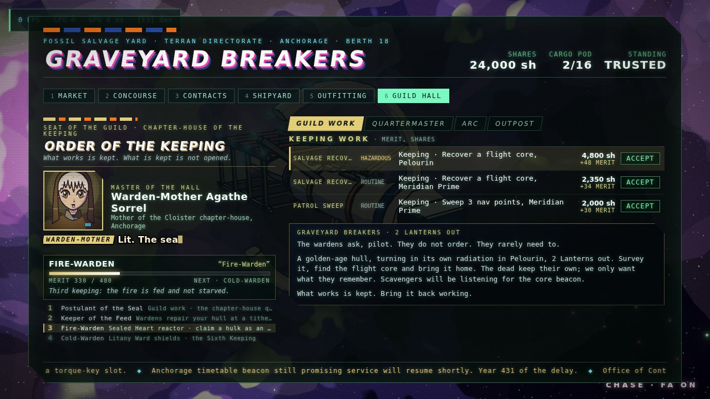
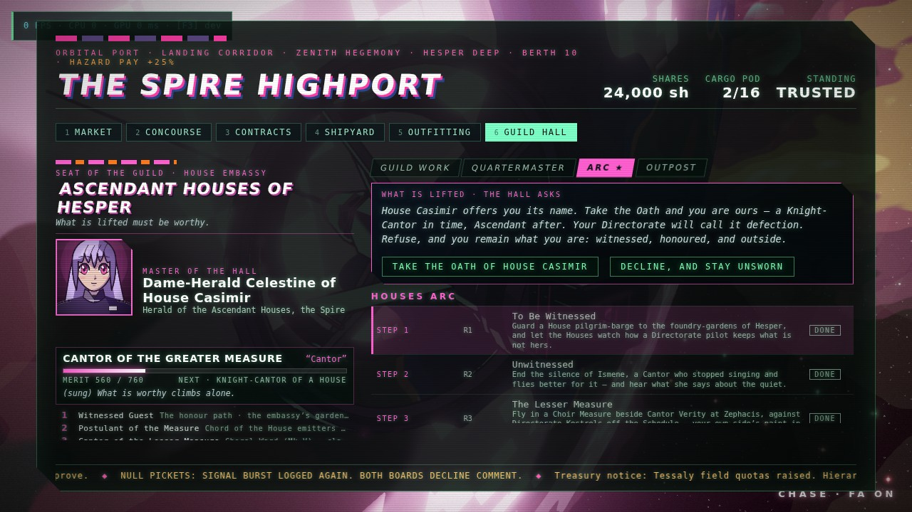
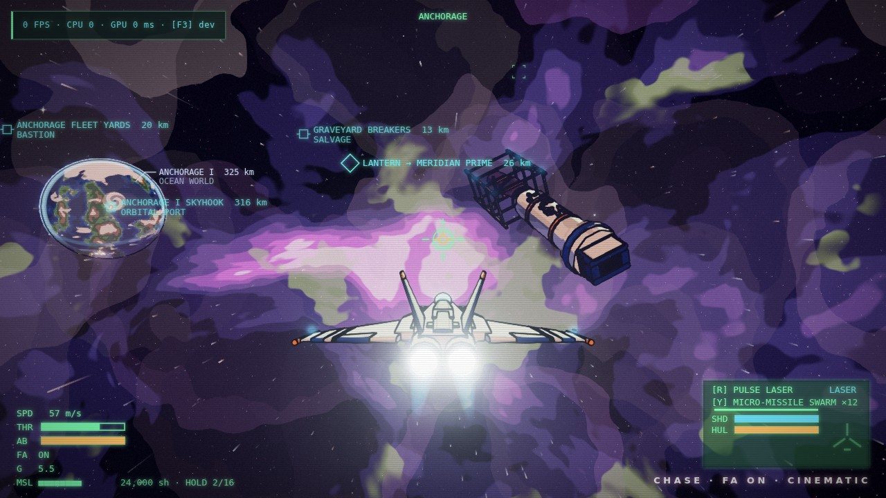
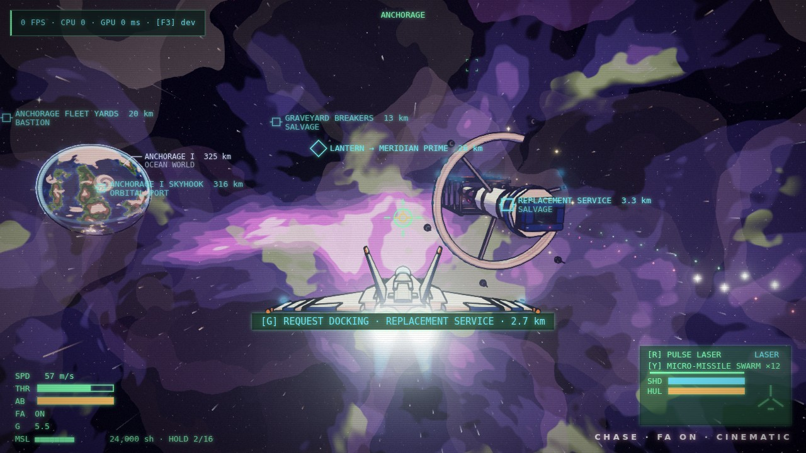
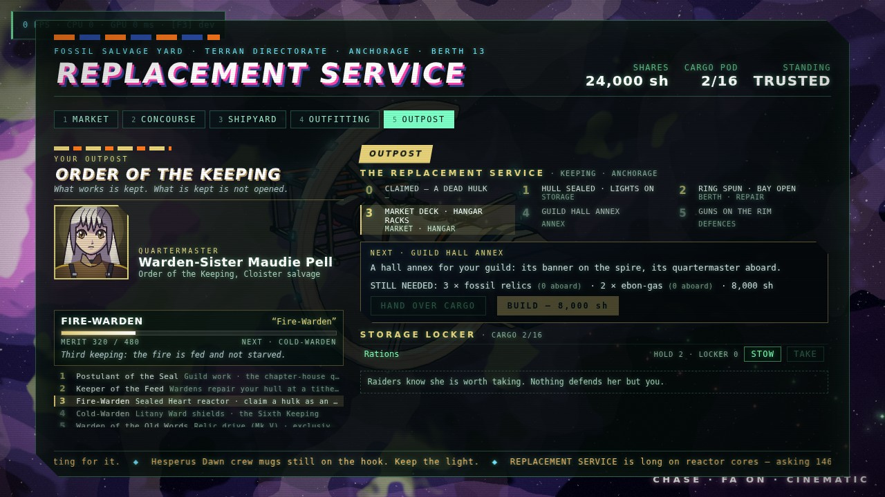

## Scenes (`?scene=`)

`flight` (default game) · `showcase` · `hangar` (model sheets) · `paint`
(livery editor) · `spatial` (depth cues) · `dogfight` (AI demo) ·
`combat&stage=capital|shield|smoke|weapons` (damage / shields / weapon
families, `&freeze=S` holds a frame) · `fx`
(particles) · `setpieces&piece=monolith|megagate|derelict|nebula|bastion|pilgrimage|…`
· `comms` · `audio` · `prologue` (the ~60 s cold open; `&t=SECONDS` seeks,
loops as an attract reel) · `trailer` (the 90 s gameplay trailer; `&t=`
seeks, `&reel=N` plays N× faster). Add `&episode=N` to `flight` to jump into a
campaign episode.

**Prologue.** A new profile sees the cold open once before Episode 1 (skip:
Space / Esc / click); it is also on the title menu, and plays by itself when
the title is left idle. Shots are plain data in `src/cinema/prologue.ts`, run
by a small sequencer (`src/cinema/`): keyframed or rig-tracked cameras in km,
postFx envelopes, captions, music / SFX / stage cues — all pure functions of
time, so any frame can be seeked and screenshotted.

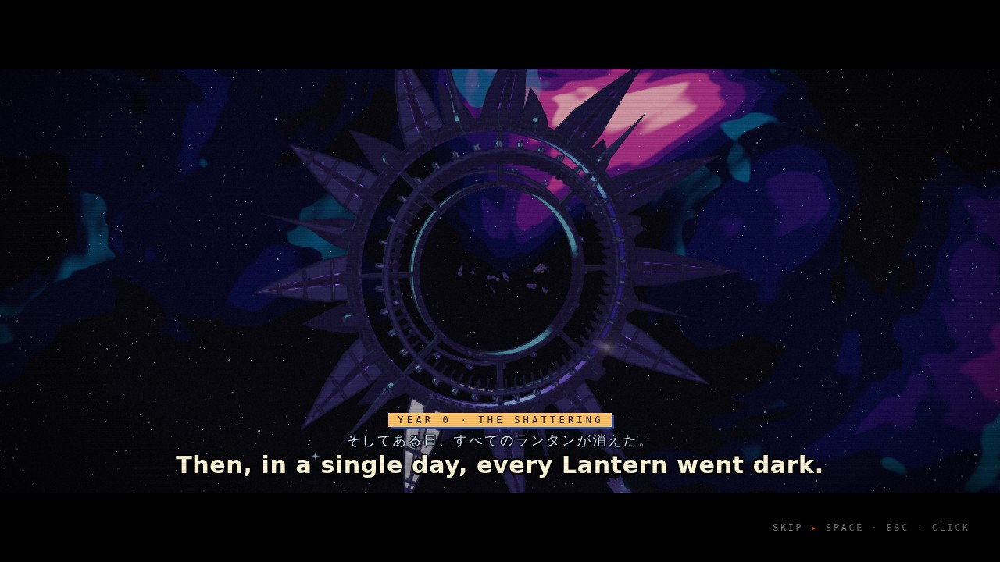

**Trailer.** `?scene=trailer` (also TRAILER on the title menu): 90 s cut on
the same sequencer — the Signal's prime count, "In the Long Dark…", then
three movements behind OVA eyecatch cards. **FIGHT.** a catapult launch, a
head-on merge, a tail chase, a break, the micro-missile circus, a Cathedral
with burning batteries, a dreadnought's fore shield collapsing, a line of
battle (cut on the 156 bpm combat score's beat). **TRADE.** Castellan's
rings, haulers through a Lantern, a liner, the corridor and the hollow bay,
the real dock screen (market, a concourse greeting). **RISE.** the model
sheet up the ladder, the Kestrel → Valiant line at true scale, a frigate
broadside. Title card, tagline, end slate. The fights are the game's own
sims driven by scripted pilots (`src/cinema/TrailerStage.ts`: kinematic
paths, a fire flag, scripted kills; bolts, beams, shield facings, missiles,
section blasts and craters are real); the Reach is the live Meridian system;
UI shots open the dock screen display-only on a demo ledger
(`src/cinema/TrailerUi.ts`). Shot list: `src/cinema/trailer.ts`
(`tests/trailer.test.ts`: ~90 s, cards in order, cams tile, beat-cut combat,
readable subtitles).

**Attract mode.** Left idle 45 s, the title plays the prologue, comes back,
then the trailer, and so on; any key, click or pad input returns to the
title. Scene swaps tear the old scene down (GPU buffers, materials, the ink
pipeline's render targets, DOM), so it runs unattended: `npm run
attract-check` soaks the loop headless (`?idle=20&reel=24`, 3 cycles ≈ 12 min
of unattended play) and checks renderer.info geometries / textures, JS heap
and DOM size cycle to cycle.

**Clips.** The capture pipeline is frame-stepped (`?record=fps`: each frame
advances exactly 1/fps, CSS animations run on the film clock), so any scene
renders to video headless, in parallel ranges:

```bash
export VITE_CACHE_DIR=/tmp/vc      # own Vite dep cache on a shared machine
node scripts/record.mjs --scene trailer --fps 24 --from 0      --to 31.292 --out frames --port 5405 &
node scripts/record.mjs --scene trailer --fps 24 --from 31.292 --to 62.015 --out frames --port 5407 &   # start ~1 min apart
node scripts/record.mjs --scene trailer --fps 24 --from 62.015 --to 89.385 --out frames --port 5408 &
node scripts/audio-render.mjs --only trailer --out audio   # the soundtrack: music, SFX, every voiced line
FFMPEG=/path/to/ffmpeg node scripts/make-video.mjs --frames frames --audio audio/trailer.wav --crf 23 --out trailer-720p.mp4
```

Ranges split on shot boundaries (sims replay from the cut). Photo mode (F10)
covers stills.


**Shipyard.** 28 hull designs. The Vanguard progression line runs T1 Kestrel
(17 m) → T2 Super Kestrel → T3 Gauntlet heavy fighter → T4 Bulwark gunship
(56 m) → T5 Resolute corvette (177 m, crew 20) → T6 Valiant light frigate
(380 m, flown from the bridge). Alternates come from other yards: the Hegemony
Seraph at high standing, and the Rustwake Knuckleduster and Scrapjack. Also:
Rustwake Gaff harpoon raiders, Bulldog gunboats and the Mother Lode
hauler-carrier; civil traffic (Swallow courier, Tallow mining barge, Longhaul
freighter, Umbra Ebon tanker, Meridian Star liner); and line warships (DDG-40
Arbiter, Hegemony Canticle). Prices, tiers, crew, hardpoint layouts and stat
hints are data in `src/game/shipyard/catalog.ts`. Handling and camera
distance scale with hull size (`src/game/shipyard/flight.ts`). To view them:
`?scene=hangar&cam=6..11` (scale charts with captions),
`?scene=hangar&ship=<id>` (four-view model sheet), and
`?scene=dogfight&ship=<id>` (fly it; `&bridge=1|0` forces the bridge camera
on or off).

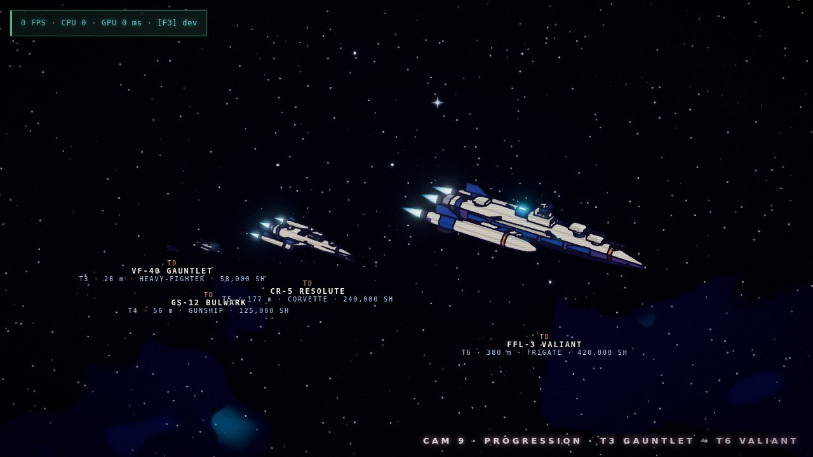

## How it's built

**Rendering.** A scene pass writes an MRT G-buffer (HDR cel colour; view
normal + linear depth in km; ink weight + region id + haze). A hand-written
WGSL kernel draws the ink: inverse-depth Laplacian silhouettes (flat plating
never fires, line weight is scale-invariant), normal creases, and region-id
panel lines, with 12 Hz "line boil". Then aerial haze, emissive-only bloom,
tone map, grade, speed lines / chromatic focal distortion, FXAA. Dynamic
resolution holds the frame budget.

**Space.** Universe positions are float64 on the CPU; the GPU only ever
sees camera-relative coordinates (`WorldSpace`), so a 3 km dreadnought
2,600 km from the origin — or a moon-sized sphere 30,000 km away — doesn't
jitter. Space dust, asteroid belts and haze lanes give parallax and speed.

**Simulation.** Every ship — player, wingmen, enemies, capitals — flies the
same `FlightModel` from the same `ControlState`; only the writer differs
(input vs AI). The ship responds on the frame the input arrives; only the
camera lags. Plain arrays and functions: `Fleet`, `Weapons` (swept-sphere
bolts, tracking beams), `Missiles` (proportional navigation + Itano
spirals), `Capitals` (flak, lances, hangars), `ai/*` (behaviour selection,
maneuvers, formations, turrets).

**Combat.** Every design has stats (hull, shields, regen, mass, agility,
speed, signature) and a loadout (`src/sim/Loadouts.ts`): Directorate pulse
lasers and kinetic autocannon, the Choir's hymn pulse and beam-lance, the
Rustwake scattergun; micro-missile swarms, slow heavy torpedoes that point
defence can shoot down, harpoons. Damage types scale against shields and
hull. Capitals carry four shield facings and a voxel hull, so fire lands on
the plating and wrecks the subsystem under it — turrets, lances, hangars,
engines (she drifts), the shield generator (shields gone for good), the bridge
(fire control lost). Once the facing over a mount is down it is *exposed*:
it can be selected (B, exposed ones first; I for the one under the
crosshair), shot through its own hit sphere, and knocked out. Torpedoes
splash every mount near the burst, a wrecked hangar cooks off, and damage
control slowly patches what is left (`src/sim/Subsystems.ts`). Wingmen told
to attack your target go for the mount you picked; AI wings on a capital
work a facing down, then strafe its exposed turrets and lances (bombers:
the shield generator and engines). Fighters take damage by zone: engines lose thrust, a
shot-up wing rolls, a dying ship trails black smoke. Damage is painted on the
cel hull: scorched patches, screentone hatching, glowing craters.
`npm run balance` holds the numbers (Kestrel vs Cantor 3–8 s, a turret to a
wing of four 5–15 s, a capital to a squadron 60–180 s).

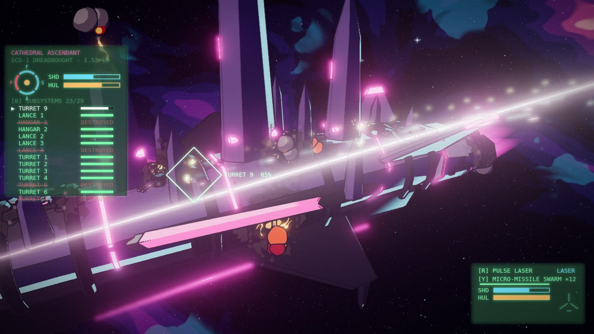

**Story.** Missions are data (`src/game/campaign`), run by
`CampaignRunner` (tested) through a small host adapter: story roles →
teams (renegades, defectors, provokable neutrals), plot armour, script
cues, escorts, dwell zones, set pieces, radio chatter with procedural
anime portraits, codex unlocks, eyecatches and debriefs.

**Sound.** Web Audio synthesis only: faction weapons, explosions, engine and
jump loops, lock tones, radio; a generative OVA-style score with moods that
follow the fight and the story.

## Layout

```
src/
  core/      engine loop, input, perf, floating origin, flags
  render/    renderer, light rig, cel/glow materials, ink pipeline + WGSL
  assets/    blueprint format, hull kit, ship builder, 28 designs
  sim/       flight, fleet, weapons, missiles, capitals, cameras, ai/
  fx/        WebGPU compute particles, trails
  world/     sky, planets, gates, dust, asteroids, set pieces, scenes
  universe/  seeded Meridian Reach + special locations
  game/      campaign data, runner, session, missions, profile
  audio/     synthesis engine, SFX, generative music
  ui/        HUD, star map, comms, codex, eyecatch, screens
  cinema/    cutscene sequencer + the prologue (shots, sets, overlay)
tests/       node:test suites (runner + campaign data)
scripts/     screenshots, perf, AI sim, audio render (headless)
docs/        lore, campaign, roadmap, screenshots
```
