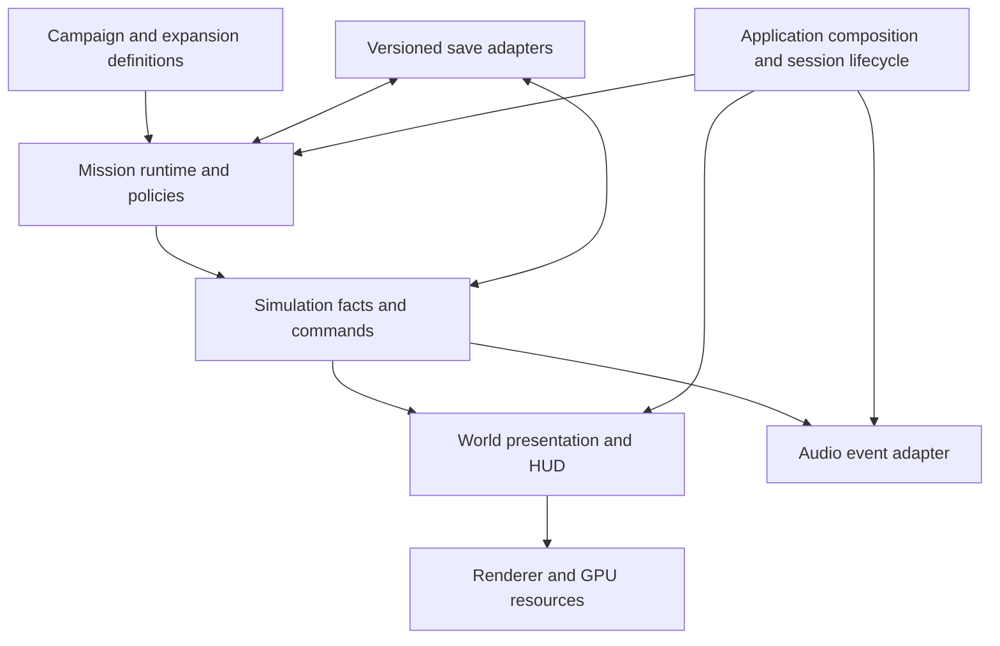

# Vanguard engine direction

Chief architecture decision, 25 September 2026. This is a code audit and staged
refactor plan, not a claim that every original milestone is production-ready.
It complements [game direction](GAME-DIRECTION.md).

The initial implementation audit used baseline `2882b74`. Mission maintenance
landed in `39d1d29` / `b0c8535`; combat correctness and spatial audio subsequently
landed in `9b1e769` / `3cb0945`. Current audio status below reflects those commits.
The Kessen assault videos remain standalone staged demonstrations, separate from
campaign acceptance. The bounded expansion foundation and its four review fixes
are integrated as a prototype; combined evidence and remaining acceptance gates
are in [the chief integration review](EXPANSION-CHIEF-REVIEW.md).

## Decision

Keep the existing TypeScript / Three.js engine. Preserve the fixed-step game
simulation and use WebGPU for presentation and suitable visual compute work.
Make missions, world content and expansion content clients of the engine rather
than reasons to add more branches to FlightScene. Refactor in small, independently
reviewable slices with replay and save compatibility evidence.

Do not undertake a new engine, generic ECS conversion, or GPU combat-physics
rewrite as part of this maintenance work. Deterministic combat, comprehensible
missions and reliable saves take priority over a larger framework.

## What exists and what needs work

| Area | Current implementation | Direction / remaining gap |
| --- | --- | --- |
| Simulation | `core/Engine.ts` has a fixed 60 Hz update, bounded catch-up, render interpolation and capture stepping. | Simulation owns facts; presentation reads them. Retain seeded/replayable behaviour. |
| Ship contact | Large-hull swept box contact uses effective mass/inertia, energy-based local damage and existing structural breakup; fighter paths remain separate. | Bounded approximation accepted with replay and native evidence. Rotational CCD, concave geometry, large-ship/station contact and route/spawn clearance need further work; see `CONTACT-INTEGRATION.md`. |
| Missions | Typed definitions, predicates and a common `CampaignRunner`; `CampaignSession` connects story rules to the world. | One episode per file, static content checks, headless behavioural tests. Extract more scene orchestration only with parity evidence. |
| Contracts | `contracts/ContractDesk.ts` runs generated operations with their own lifecycle and persistence. | Reuse runner mechanisms, preserve distinct story and contract policies. |
| Cel shading | TSL cel materials/rim light, explicit ink channels, MRT and a post-processing pipeline. WebGPU and WebGL2 paths exist. | Rendering owns materials, GPU resources and capabilities; missions request effects through adapters. Test each backend honestly. |
| Sound | Web Audio buses with distinct combat/cockpit routing; stereo, headphone HRTF and optional discrete 5.1, saved controls and speaker test. | Six-channel processing is implemented and checked offline. Physical speaker mapping/levels remain unverified on this two-channel device. |
| Saves | Profile and mission snapshots; atomic versioned career envelope for money plus hangar, with legacy migration on the first paired transaction. Failed initial reads lock writes until a fresh load. | Persist before changing live equipment or acknowledging purchases. Existing mission content order remains part of the save contract; expansion IDs and migrations remain staged work. |
| Universe / expansions | Validated civilization/language registries, separate 192-record survey atlas, six-system flight addition, eight hull blockouts and guarded contact persistence. | Bounded prototype integrated; native art, flown missions, fleet performance and U08 production acceptance remain open. |
| Composition | `main.ts` assembles services; `FlightScene.ts` still combines many game systems. | Gradually extract session/lifecycle ownership and event adapters, keeping assembly at the outside. |

## Module boundaries

The intended dependency flow is:

Content must not import scenes, DOM nodes, renderer instances or sound nodes.
The runner should remain testable through its host interface without a canvas.
The existing Vector3 dependency does not require a renderer and need not be
removed merely to satisfy a diagram. Only game rules decide kills, objective
completion, shield/hull damage and rewards; camera shots and effects cannot
silently change those facts.

Story and contract policies are deliberately different today. Story escort
alignment, plot armour, speed and player-death failure differ from contract
escort hull/speed, failure suppression and persistence on leaving an operation.
An extraction must preserve those behaviours rather than flattening them into
one default. Start with explicit policy adapters, not a global event bus.

## First reform

All twenty episode definitions move from the large `missions.ts` into
`game/campaign/episodes/`. `missions.ts` remains the compatible public entry
point. Shared authoring functions live in `authoring.ts`; runtime plot-armour
and fallback-system tables live in `runtimePolicy.ts`. Episode order, IDs,
dialogue, predicate bodies and spawn/objective order are preserved.

`validate.ts` is a pure authoring check with injected catalogs. It catches
unknown blueprints, speakers, codex entries, explicit tag/objective references,
duplicate IDs and malformed numeric values, reporting mission ID and field
path. `npm run check:campaign` checks the real catalog and also runs in `build`.
It does not execute predicates or prove a mission completable.

The accompanying restore fix validates the complete mission snapshot before
changing runner state or invoking its host. Previously a malformed `fired`
field could throw after time and flags had already changed, contaminating a
caller's fresh-start fallback. Valid saves retain their existing schema and
index semantics. This is not rollback for exceptions thrown by host callbacks.

See [mission authoring](MISSION-AUTHORING.md) for the everyday workflow.

## Dependable loop follow-through — 26 September

Objective navigation is authored alongside each episode and resolved through a
pure `ObjectiveNavigation` adapter. The HUD reads copied positions from the
current required objective; it does not own progression or save marker state.
EP04 follows the live convoy, and EP05 exposes successive survey destinations.
Optional route-arrival and formation metadata correct EP02's carrier transfer
and EP10's lifeboat spacing without introducing episode switches in the solver.

Dock purchases, fitting and paid repairs use an explicit acceptance result.
Money and hangar changes share one `CareerStore` commit point; live changes,
success cues and replay commands follow successful persistence. Read failure
during startup cannot silently replace an existing career with fallback defaults.
The native dock matrix covers failure, retry and reload through real controls.
These boundaries make mission and economy defects reproducible without a GPU;
ordinary-flight and presentation captures supply the separate native checks.

Current acceptance and its limits are recorded in
[the mission-loop review](MISSION-LOOP-REVIEW.md), including the unchanged
boundaries around guild/world stores and multi-tab concurrency.

## Rendering ownership

`RendererFactory.ts` selects and reports the actual backend. `CelMaterial.ts`
owns the toon/rim surface model; `InkChannels.ts` defines ink data. The current
`InkPipeline.ts` performs scene MRT, edge extraction (WGSL on WebGPU, TSL on
WebGL), haze, ink, bloom, tone mapping/output conversion, grading/grain and FXAA.
Dynamic resolution and recovery are assembled by the application.

The next rendering refactor should give each session an explicit resource owner
with dispose/rebuild hooks and capability reporting. Audit global light,
material-uniform and post-effect state before allowing multiple scenes or device
recovery to reuse them. Separate ship gameplay bounds and sockets from their
mesh/material presentation incrementally. Compute effects require their own
fallback policy; fallback availability does not imply visual/performance parity.

Acceptance: native WebGPU and forced WebGL scene captures, repeated launch/leave
cycles, recovery where supported, unchanged gameplay hashes, and measured frame
time/memory on a stated device. Bounded Package A correctness fixes are reconciled
in `b0212de`: portable shield hex shaders, actual-device/timing reporting,
restart controls, refit resource cleanup, subsystem armour scaling and optional
reduced effects. Default bloom/ink and reviewed combat cadence are preserved.
The renderer owner verified 350 tests and native resource/restart/shader checks;
combined integration evidence is tracked in
[the consolidation record](CONSOLIDATION-2026-09-25.md). Historical frame-time
targets and final visual signoff remain open. See
[the reconciliation record](RENDER-RECONCILIATION.md) for precise exclusions.

## Audio and 5.1

`audio/index.ts` orchestrates game sound. `AudioEngine.ts` owns buses and output
processing; `Music.ts` owns score playback; voice code owns cast recordings and
fallbacks. Offline trailer narration is a production asset, not automatically a
replacement for the runtime cast.

The current graph separates external combat from cockpit feedback. Source
identity and actual damage layers drive distinct sounds, and beam bodies follow
live emitters until release. The shared pool remains bounded at forty voices.
The settings panel persists Master, Music, Effects and Dialogue levels, dynamic
range and requested output mode.

Three modes are now implemented: default stereo speakers, two-channel headphone
HRTF, and optional discrete 5.1. `spatial.ts` routes supported outputs to
L/R/C/LFE/SL/SR; recorded/synthesized dialogue is centred, bass contributions are
low-pass filtered, and a linked six-channel AudioWorklet limiter preserves
direction. Destination capability and worklet failures produce an explained
stereo fallback. The standard offline trailer delivery remains stereo.

The audio task's real Web Audio offline checks cover source directions, six
isolated channels, centred dialogue, HRTF sides, beam sustain/release and settings
persistence. Native Edge exercised three combat auditions and stereo fallback.
The physical device exposes only two channels: a connected six-speaker mapping
and level check is still required. Receiver upmix is not native-routing evidence.
Optional operating-system speech respects Master and Dialogue for new utterances
but remains outside the Web Audio routing graph; deterministic/surround dialogue
must use buffered audio through the mixer.

See [combat/audio implementation and evidence](COMBAT-AUDIO-IMPROVEMENTS-2026-09-25.md).
Its reported combined checks pass 322 tests, unchanged balance bands, ten-minute
repeat/replay determinism for three scenarios and the production build. Coverage
was for the original 28 hulls. The subsequent combined expansion run passed 343
tests, including the contact/damage matrix across all 36 hulls, unchanged balance
bands and ten-minute replay checks. These do not establish new-civilization combat
balance or native fleet performance. Hardware acceptance and full-battle
subjective mix review remain distinct from offline signal checks.

## Expansions and compatibility

New civilizations, cultures, languages, systems and missions should be content
registered under stable namespaced IDs, with explicit dependencies and content
versions. Keep faction combat relationships separate from culture and language.
Use deterministic regional generation so adding distant content does not silently
regenerate the player's current region. Future content-pack manifests and a
registry loader are planned boundaries, not implemented mod support.

Before changing existing IDs or ordering, introduce save migrations with fixtures
for old saves and missing/disabled content. Preserve unknown optional data when
safe; report missing required content instead of silently discarding progress.
Keep story campaign order distinct from generated contracts and expansion arcs.
The active universe-expansion owner must coordinate changes to shared schemas,
localization, profile and composition files with the chief before integration.

## Next slices and acceptance

1. Land mission modules, content checking and the snapshot regression fix. Require
   typecheck, the existing test suite, build, and exact extracted-content parity.
2. Improve actual authoring gaps: explicit set-piece parameter schemas; a real
   dead-gate/ring representation (current Wreckage ignores `shape: 'ring'`);
   navigation tags for EP04/05; audit the unconsumed `noWingmen` modifier. These
   change behaviour/content and need their own replay and visual checks.
3. Extract FlightScene session orchestration behind explicit lifecycle adapters.
   Test story and contract entry, failure, departure, restore, and multi-system
   continuation before deleting the old wiring.
4. Integrate renderer lifecycle/capability work with visual and recovery evidence.
   Complete physical surround verification and gameplay mix review for the
   implemented audio modes.
5. Integrate expansion registries and versioned saves in small reviewed packages;
   validate old profiles and deterministic world fixtures with each package.

For bug reports, retain source revision, seed, episode/operation ID, input replay,
backend/output mode and relevant save. Reproduce first, add a focused regression
at the lowest responsible layer, then verify the affected gameplay path. Full
playthroughs and hardware checks remain necessary for claims automation cannot
establish. Trailer production keeps its frozen capture baseline during this work.

## Verification of the first slice

- Mechanical extraction comparison: all twenty mission objects, function source
  strings, ordering and the two runtime-policy tables equal the original data.
- Real-content validation: all twenty episodes pass against runtime blueprints,
  cast and codex. Six focused validator tests pass, including deliberately broken
  references and a predicate that throws if validation tries to execute it.
- Snapshot/runner/contracts checks: 23 tests pass, including malformed late
  records rejected before any survivor is spawned and valid restore continuity.
- Combined suite: 319 tests pass. Existing Vite test servers log HMR-port
  contention warnings but no test failures.
- Production build, including TypeScript and the new content check, passes.

These checks do not claim a fresh GPU playthrough, physical surround verification,
or validation of other tasks' uncommitted shared-checkout changes.
