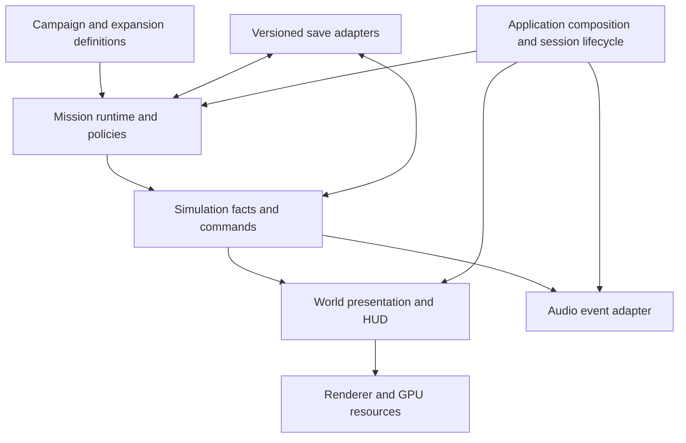

# Vanguard engine direction

Chief architecture decision, 25 September 2026. This is a code audit and staged
refactor plan, not a claim that every original milestone is production-ready.
It complements [game direction](GAME-DIRECTION.md).

The implementation audit below is against committed baseline `2882b74` plus
this mission-maintenance slice. A separate task, **Review weapon and shield
audio**, is actively implementing combat/audio fixes and surround routing in
the shared checkout. Those uncommitted changes are not included in the baseline
claims or accepted by this audit; integrate their evidence and update output-mode
status when that package is ready. The newly authorised Kessen assault videos
are standalone staged demonstrations, separate from campaign acceptance.

## Decision

Keep the existing TypeScript / Three.js engine. Preserve the fixed-step game
simulation and use WebGPU for presentation and suitable visual compute work.
Make missions, world content and expansion content clients of the engine rather
than reasons to add more branches to FlightScene. Refactor in small, independently
reviewable slices with replay and save compatibility evidence.

Do not undertake a new engine, generic ECS conversion, or GPU combat-physics
rewrite as part of this maintenance work. Deterministic combat, comprehensible
missions and reliable saves take priority over a larger framework.

## What exists and what needs work

| Area | Current implementation | Direction / remaining gap |
| --- | --- | --- |
| Simulation | `core/Engine.ts` has a fixed 60 Hz update, bounded catch-up, render interpolation and capture stepping. | Simulation owns facts; presentation reads them. Retain seeded/replayable behaviour. |
| Missions | Typed definitions, predicates and a common `CampaignRunner`; `CampaignSession` connects story rules to the world. | One episode per file, static content checks, headless behavioural tests. Extract more scene orchestration only with parity evidence. |
| Contracts | `contracts/ContractDesk.ts` runs generated operations with their own lifecycle and persistence. | Reuse runner mechanisms, preserve distinct story and contract policies. |
| Cel shading | TSL cel materials/rim light, explicit ink channels, MRT and a post-processing pipeline. WebGPU and WebGL2 paths exist. | Rendering owns materials, GPU resources and capabilities; missions request effects through adapters. Test each backend honestly. |
| Sound | Web Audio music, effects and voice buses; camera-relative stereo panning, dynamics and reverb. | Stereo is implemented. Native 5.1 is not. Build explicit output modes and routing before advertising surround. |
| Saves | Profile and mission snapshot persistence; existing content order is part of the save contract. | Validate before mutation now; add versioned IDs and explicit migrations with expansion work. |
| Universe / expansions | Seeded world and campaign data exist. A separate expansion branch is adding registries, atlas and save support. | Integrate additive content through validated registries. Branch progress is not release acceptance. |
| Composition | `main.ts` assembles services; `FlightScene.ts` still combines many game systems. | Gradually extract session/lifecycle ownership and event adapters, keeping assembly at the outside. |

## Module boundaries

The intended dependency flow is:

Content must not import scenes, DOM nodes, renderer instances or sound nodes.
The runner should remain testable through its host interface without a canvas.
The existing Vector3 dependency does not require a renderer and need not be
removed merely to satisfy a diagram. Only game rules decide kills, objective
completion, shield/hull damage and rewards; camera shots and effects cannot
silently change those facts.

Story and contract policies are deliberately different today. Story escort
alignment, plot armour, speed and player-death failure differ from contract
escort hull/speed, failure suppression and persistence on leaving an operation.
An extraction must preserve those behaviours rather than flattening them into
one default. Start with explicit policy adapters, not a global event bus.

## First reform

All twenty episode definitions move from the large `missions.ts` into
`game/campaign/episodes/`. `missions.ts` remains the compatible public entry
point. Shared authoring functions live in `authoring.ts`; runtime plot-armour
and fallback-system tables live in `runtimePolicy.ts`. Episode order, IDs,
dialogue, predicate bodies and spawn/objective order are preserved.

`validate.ts` is a pure authoring check with injected catalogs. It catches
unknown blueprints, speakers, codex entries, explicit tag/objective references,
duplicate IDs and malformed numeric values, reporting mission ID and field
path. `npm run check:campaign` checks the real catalog and also runs in `build`.
It does not execute predicates or prove a mission completable.

The accompanying restore fix validates the complete mission snapshot before
changing runner state or invoking its host. Previously a malformed `fired`
field could throw after time and flags had already changed, contaminating a
caller's fresh-start fallback. Valid saves retain their existing schema and
index semantics. This is not rollback for exceptions thrown by host callbacks.

See [mission authoring](MISSION-AUTHORING.md) for the everyday workflow.

## Rendering ownership

`RendererFactory.ts` selects and reports the actual backend. `CelMaterial.ts`
owns the toon/rim surface model; `InkChannels.ts` defines ink data. The current
`InkPipeline.ts` performs scene MRT, edge extraction (WGSL on WebGPU, TSL on
WebGL), haze, ink, bloom, tone mapping/output conversion, grading/grain and FXAA.
Dynamic resolution and recovery are assembled by the application.

The next rendering refactor should give each session an explicit resource owner
with dispose/rebuild hooks and capability reporting. Audit global light,
material-uniform and post-effect state before allowing multiple scenes or device
recovery to reuse them. Separate ship gameplay bounds and sockets from their
mesh/material presentation incrementally. Compute effects require their own
fallback policy; fallback availability does not imply visual/performance parity.

Acceptance: native WebGPU and forced WebGL scene captures, repeated launch/leave
cycles, recovery where supported, unchanged gameplay hashes, and measured frame
time/memory on a stated device. Existing rendering Package A work remains on its
owner's branch until combined-tree review; this document does not accept it.

## Audio and 5.1

`audio/index.ts` orchestrates game sound. `AudioEngine.ts` owns buses and output
processing; `Music.ts` owns score playback; voice code owns cast recordings and
fallbacks. Offline trailer narration is a production asset, not automatically a
replacement for the runtime cast.

Current effects use left/right pan, distance attenuation and filtering. Voice
uses stereo panning. The offline render path writes two channels. There is no
explicit centre, LFE or rear-channel routing and no tested six-channel output
mode. A receiver upmixing stereo is not evidence of native 5.1.

Build three clearly reported modes: stereo speakers, headphones, and native 5.1
where the browser/device actually supports it. Headphone spatial processing is
still a two-channel output. Probe capabilities, construct an explicit bus/channel
map, and keep master processing compatible with the chosen channel count; simply
changing the destination count is insufficient. Route dialogue intentionally,
define bass-management policy, and preserve an intelligible stereo downmix.
Optional browser speech currently bypasses parts of the controlled Web Audio
route; deterministic export and surround need buffered audio through the mixer.

Acceptance: six independent channel-identification signals, correct dialogue
placement, downmix/peak tests, fallback mode reporting, and physical speaker
verification. Do not mark 5.1 complete from an MP4 label or code-only test.

## Expansions and compatibility

New civilizations, cultures, languages, systems and missions should be content
registered under stable namespaced IDs, with explicit dependencies and content
versions. Keep faction combat relationships separate from culture and language.
Use deterministic regional generation so adding distant content does not silently
regenerate the player's current region. Future content-pack manifests and a
registry loader are planned boundaries, not implemented mod support.

Before changing existing IDs or ordering, introduce save migrations with fixtures
for old saves and missing/disabled content. Preserve unknown optional data when
safe; report missing required content instead of silently discarding progress.
Keep story campaign order distinct from generated contracts and expansion arcs.
The active universe-expansion owner must coordinate changes to shared schemas,
localization, profile and composition files with the chief before integration.

## Next slices and acceptance

1. Land mission modules, content checking and the snapshot regression fix. Require
   typecheck, the existing test suite, build, and exact extracted-content parity.
2. Improve actual authoring gaps: explicit set-piece parameter schemas; a real
   dead-gate/ring representation (current Wreckage ignores `shape: 'ring'`);
   navigation tags for EP04/05; audit the unconsumed `noWingmen` modifier. These
   change behaviour/content and need their own replay and visual checks.
3. Extract FlightScene session orchestration behind explicit lifecycle adapters.
   Test story and contract entry, failure, departure, restore, and multi-system
   continuation before deleting the old wiring.
4. Integrate renderer lifecycle/capability work with visual and recovery evidence.
   Implement surround as a separately tested audio feature.
5. Integrate expansion registries and versioned saves in small reviewed packages;
   validate old profiles and deterministic world fixtures with each package.

For bug reports, retain source revision, seed, episode/operation ID, input replay,
backend/output mode and relevant save. Reproduce first, add a focused regression
at the lowest responsible layer, then verify the affected gameplay path. Full
playthroughs and hardware checks remain necessary for claims automation cannot
establish. Trailer production keeps its frozen capture baseline during this work.

## Verification of the first slice

- Mechanical extraction comparison: all twenty mission objects, function source
  strings, ordering and the two runtime-policy tables equal the original data.
- Real-content validation: all twenty episodes pass against runtime blueprints,
  cast and codex. Six focused validator tests pass, including deliberately broken
  references and a predicate that throws if validation tries to execute it.
- Snapshot/runner/contracts checks: 23 tests pass, including malformed late
  records rejected before any survivor is spawned and valid restore continuity.
- Combined suite: 319 tests pass. Existing Vite test servers log HMR-port
  contention warnings but no test failures.
- Production build, including TypeScript and the new content check, passes.

These checks do not claim a fresh GPU playthrough, physical surround verification,
or validation of other tasks' uncommitted shared-checkout changes.
