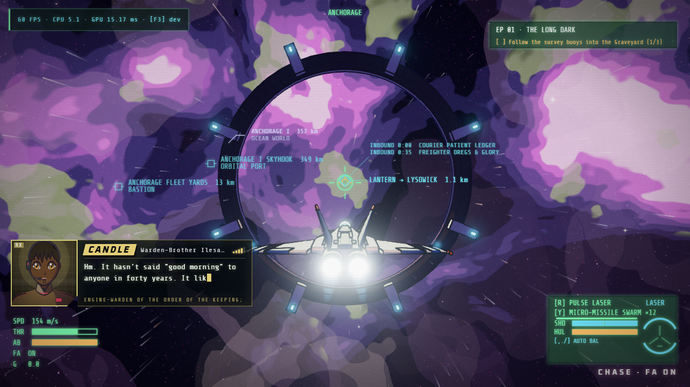
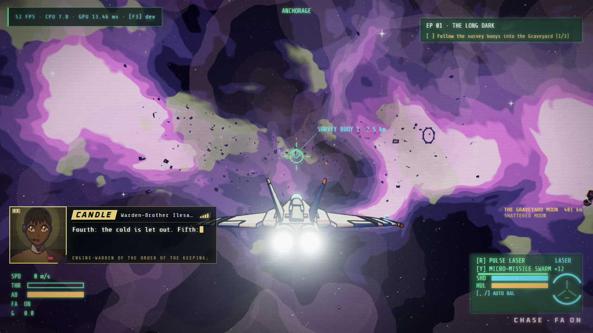
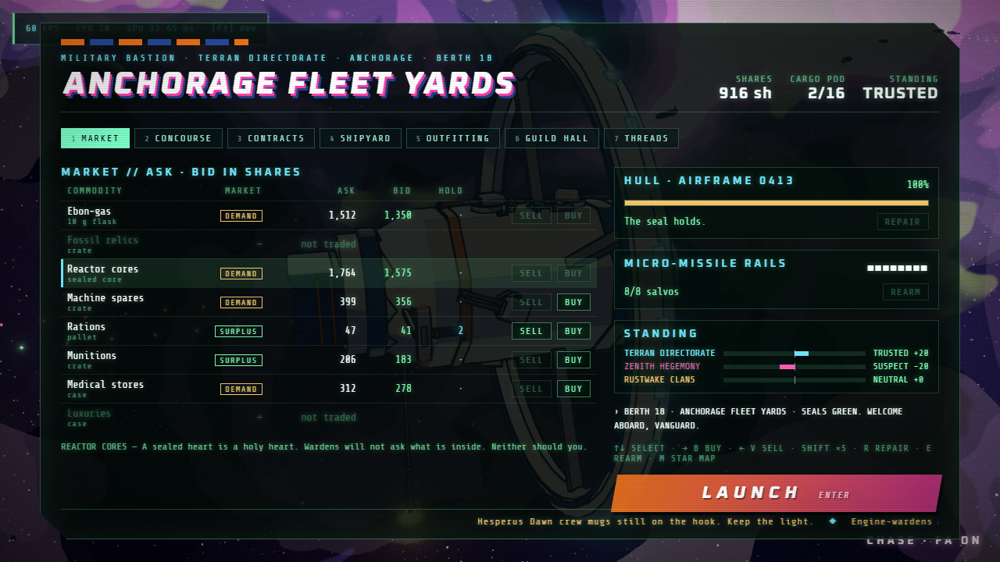
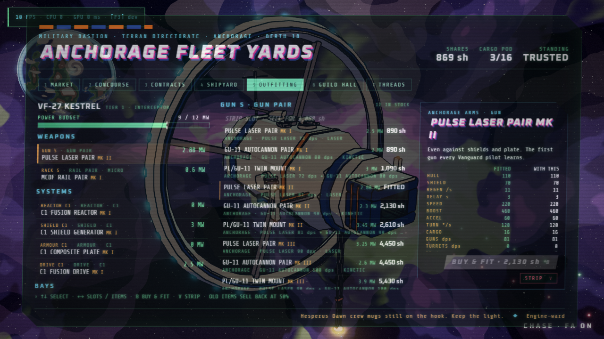
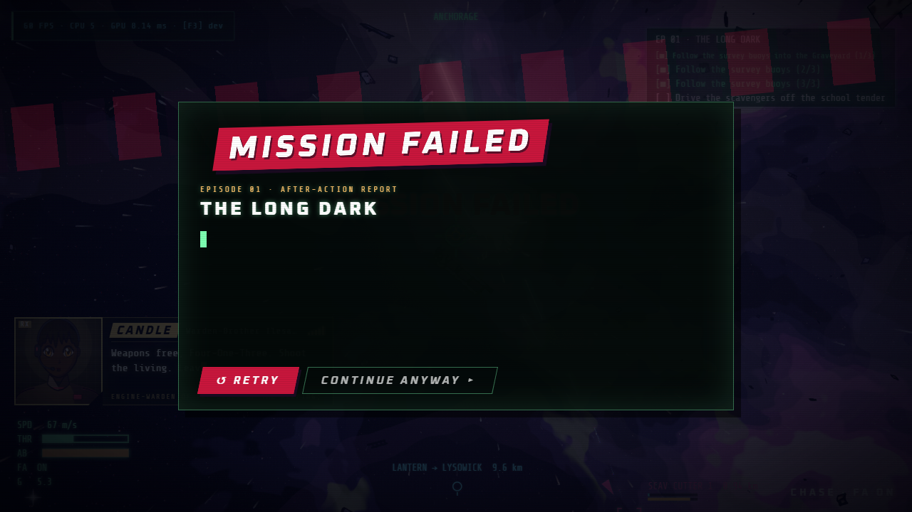

# First-session verification — 25 September 2026

Source checkpoint: `2c284ab` on `codex/integrate-audit-trailer-combat-voices`,
following the combined trailer/combat/voice checkpoint. This is local work;
the remote default branch has not been updated.

**Result: navigation blocker fixed; live trading, fitting, manual docking and
save/resume verified. Successful Episode 1 combat and completion remain open.**

## Method and limits

Used installed Edge with native WebGPU at 1280×720, D3D11, in fresh isolated
browser contexts. The live route opened the normal title with `?idle=3600`
(only extends the attract timeout). It used keyboard/mouse events and normal
UI buttons. Read-only scene telemetry recorded position, objective, hull,
balance and fit. A navigation helper steered with ordinary inputs using that
telemetry; this establishes reachability, not unaided new-player usability.
No live-route simulation stepping, teleport, objective completion, spawned
enemies, credit grants or manufactured saves were used. The user's browser
profile was never opened or changed.

The first combat encounter ended while the pilot was stationary and the test
operator was inspecting output. This is an observed loss, not evidence that
the encounter is unwinnable or poorly balanced. The subsequent career checks
used the game's normal **Continue anyway** recovery path. They do not establish
successful completion of Episode 1 or reaching its later beacon/yards in flight.

## Reproduced blocker and fix

Before the fix, the briefing requested Survey Buoy 1, but the flight HUD only
marked the Anchorage–Lysowick gate. The initial 160 m/s velocity and 0.7 throttle
pointed at that gate, while the authored survey route lay along world +Z. During
the opening dialogue, the ship crossed into Lysowick and left its objectives
roughly 40 km away in Anchorage. Beacon labels existed in data but had no active
objective navigation consumer.

The fix adds optional typed `CampaignObjective.navTag` metadata for EP01's three
buoys, Timetable beacon and yards. The runner derives the current destination
from active visible objectives; completion, failure and hidden/absent targets
cannot leave a stale marker. The HUD uses its existing diamond and shared edge
arrow placement, giving the mission destination priority over the ambient gate.
Tactical view also includes the destination. Normal gate navigation remains
when there is no mission destination; deliberate gate travel is unchanged.

Only EP01 now begins stationary, facing its authored +Z route. Other episodes
retain their launch heading and speed. FlightScene also preserves the running
engine's `ready`, `frame` and `backend` telemetry instead of clearing it on a
title-to-flight transition. The renderer was already WebGPU; the old metadata
could incorrectly report an empty backend string.

## Live results

| Route stage | Result | Evidence |
|---|---|---|
| Fresh title → prologue → skip → eyecatch → briefing → launch | Pass | Ordinary UI sequence, native WebGPU; prologue remembered on a second launch. |
| Opening dialogue | Pass after fix | Zero speed/throttle, Survey Buoy 1 active; remained in Anchorage. Automated regression also waits 30 real seconds. |
| Survey flight | Pass | Ordinary throttle/steering reached buoys 1, 2 and 3; active marker advanced and cleared for combat. |
| Scavenger encounter | Partial; victory unverified | Encounter triggered; ship was shot down by Scav Cutter 2 while unattended. Failure debrief and Continue anyway worked. |
| Career recovery | Pass | Anchorage Fleet Yards, original 2,500 shares, 2 ration pallets, recovered hull, Episode 1 still pending. |
| Market through UI | Pass | Bought a ration for 46: 2,454 shares / 3 pallets. Sold it for the updated 42 bid: 2,496 / 2. |
| Refit through UI | Pass | Pulse Laser Pair Mk II cost 2,130; old PL/GU-11 Mk I resale 550; final balance 916. `gun:gun = g-laser-mk2`. |
| Normal launch and manual redock | Pass | Launched, stopped, requested G clearance, turned back from 1,559 m, flew corridor to 997 m; normal 7-second guidance returned to berth. No docking hook used. |
| Close/reopen via unedited save export | Pass, restore method explicit | Closed browser, loaded its Playwright storage export in a new context, chose Continue Free Flight. 916 shares, 2 rations, complete hangar/fit and correct berth matched; Episode 1 remained pending. |
| Native persistent-profile durability | Pass | Imported that legitimate save once into a separate fresh Edge profile; bought a ration through UI for 47 (869 shares / 3 pallets), closed Edge, reopened the same profile **without any import or init script**. 869 / 3, Mk II laser, Anchorage berth and Episode 1 persisted. |

Both resume checks returned `system = anchorage`, `lastDock =
anchorage-bastion-0`, docking phase `docked`, no active campaign, and profile
`episode = 1`, `seenPrologue = true`. The restored hangar matched exactly.
No JavaScript page errors occurred in the live, restored or native-resume runs.

## Automated checks and their boundaries

- `npm test`: **303 passed, 0 failed**. New runner tests cover the real EP01
  buoy → combat → beacon → yards sequence, success/failure clearing, hidden and
  missing destinations, and missions without navigation metadata. These unit
  tests move a fake host; they are not a campaign playthrough.
- `npm run typecheck` and `npm run build`: pass.
- `node scripts/flow-check.mjs --port 5491 --out scratchpad/first-session/flow-fixed`:
  all checks pass. Normal UI launch and the 30-second opening check are followed
  by explicitly labelled **DEBUG** transitions: EP03 combat and EP02 escort
  retain 160 m/s, 0.7 throttle and the gate-normal heading; returning to free
  roam removes campaign navigation and retains a gate route.
- Existing `career-check`: all checks pass with native Edge. It uses direct
  recruitment/contract/purchase calls, a docking teleport and granted credits
  and standing. Its result establishes plumbing/persistence, not live approach
  or starting-balance affordability. Its header now states that limitation.
- Both harnesses select native Edge/D3D11 on Windows, accept `--browser`, isolate
  Vite caches by port and check the actual backend. HMR/file watching is disabled
  for these fixed-source runs. A concurrent test attempt hit Windows `EBUSY`
  while Vite watched the test browser's locked profile database; this was a test
  setup error, not a game save failure. The final flow run passed. The briefing
  check now waits for completed text rather than assuming a 250 ms frame delay.

Local logs, unedited save exports, before/after JSON and the continuous live
capture are under ignored `scratchpad/first-session/`. The fixed-run WebM is
`fixed-video/6d83d6a4718146773178a0f0d768e0dc.webm`; it includes idle inspection
time and the combat loss. Selected screenshots above are committed. These
captures are visual evidence, not an audio listening review or benchmark.

## Remaining acceptance work

### Bounded attended follow-up

A second fresh-profile attempt on the same source continuously operated normal
keyboard/mouse controls, including boost, guns, missile requests when locked and
the wingman attack order. It reached all three buoys at full hull in 31.42
simulation seconds, then engaged the scavengers without an idle inspection gap.
The first cutter's hull fell from 200 to 183.11. The player died at 47.98 seconds,
178 m from the tracked target, and the genuine failure debrief appeared. There
were no page errors. No kills, objectives or balance settings were changed.

This simple pursuit controller reduced throttle at close range and had no
evasive or obstacle-avoidance strategy. The loss does not distinguish combat
damage from a possible collision, and no claim about encounter fairness follows
from it. The bounded attempt was stopped after this loss; it was not repeatedly
retuned until passing. Successful EP01 completion remains unverified.

Reproduce this exact automated-input attempt with
`node scratchpad/first-session/attended-attempt.mjs`. Its read-only telemetry
trace is `scratchpad/first-session/attended/result.json`, and the continuous
native-WebGPU recording is
`attended/video/2935bb776e8b765443ac3d2808f7a972.webm` under the same scratchpad
directory. It uses a fresh isolated profile and closes its browser/server on
completion. A human can instead run `npm run dev`, launch EP01 from a separate
browser profile and use F10 photo mode to pause when inspecting results.

Complete EP01's scavenger combat, Timetable approach and successful delivery in
an attended normal-control run. Have a player assess control discovery (the
new stationary opening currently relies on the F3 control help), aiming, flight
feel and the readability of dialogue against the HUD. Review trailer/voice
performance by listening; the separate [editorial review](TRAILER_EDITORIAL_REVIEW.md)
records the narration and pitch concerns. Subsequent to this first-session run,
the chief accepted the Kessen motion/timing evidence and combined navigation
checks passed; the bounded EP10/19 cameos are now active. That separate visual
acceptance does not close the EP01 combat playthrough gap.
