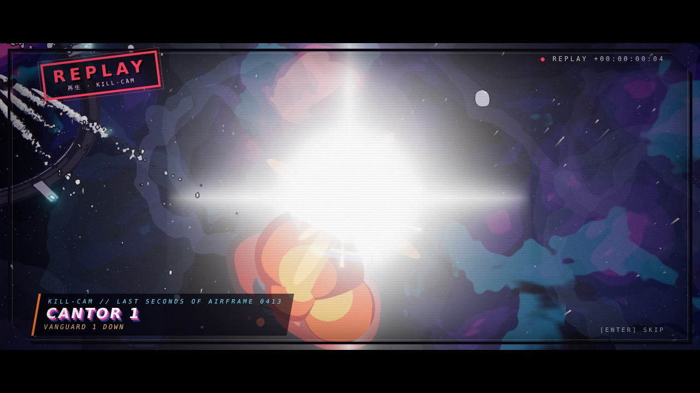

# Multiplayer — design note

Goal: the Meridian Reach as a shared, persistent space (hundreds of pilots
per system, thousands across the Reach) without giving up the thing the
single-player game is built on: **your ship responds on the frame the input
arrives; only the camera lags.**

MP-0 (determinism, replays, kill-cam) is built; the rest is a plan. Each
step has pass/fail numbers, the same as the renderer budgets.

## What we already have

- Every ship (player, wing, enemy, capital) flies the same `FlightModel`
  from the same `ControlState`; only the writer differs (input or AI). A
  networked pilot is a third writer — and a replay tape already is one.
- A fixed 60 Hz step, seeded per-system/per-entity dice and a bit-exact
  world hash (MP-0, below): the same inputs give the same world, and a
  checkpoint hash per second tells you exactly when two worlds diverged.
- The sim is plain TypeScript arrays and functions with no DOM, so it can
  run in Node/Bun on a server unchanged.
- Combat already comes out as event arrays (`weapons.events`,
  `missiles.events`), which are what a server broadcasts.
- Universe positions are float64 with a floating origin. Wire formats
  quantise relative to a km cell, so precision never depends on where in
  the Reach the fight is.
- Lantern jumps play a tunnel for several seconds, which hides the
  handoff between system shards.

## MP-0: determinism, replays, kill-cam (done)

These changes also help single-player: replays, a kill-cam, and trailer
footage from recorded input.

| Change | Why | Pass/fail | Status |
|---|---|---|---|
| Fixed 60 Hz sim step, render predicts | variable `dt` makes sims diverge | same inputs → bit-identical state after 10 min (`npm run determinism`) | ✅ 3 scenarios × 600/600 checkpoints |
| Seeded RNG per system/entity, no `Math.random` in `src/sim` | reproducible turrets, spreads, AI | lint: zero `Math.random` in the sim (`tests/no-math-random.test.ts`) | ✅ 0 |
| Sim state separate from render objects | a server has no `Object3D` | `src/sim` imports nothing from `three/webgpu`, and no sim read of a render matrix after spawn | ✅ (see *What still couples*) |
| Input as per-tick `ControlState` frames | prediction + replay | recorded sessions replay to the bit, headless and in the browser (`scripts/replay-check.mjs`) | ✅ |

### Fixed step (`src/core/Engine.ts`)

- Each frame: sample input once → run 0–4 sim ticks of exactly 1/60 s
  from an accumulator → presentation (`update`, with `alpha`) → render.
- **Latency rule kept.** The player's input is sampled at the top of the
  frame and loaded into the ship before that frame's first tick
  (`Input.beginTick`). Edge buttons (missile, next target, FA, cruise,
  cycles) fire on the first tick only. If a frame runs no tick (a display
  faster than 60 Hz), they carry over to the next frame. While the sim is
  paused (berthed, kill-cam) they are dropped.
- Vsync snapping: a frame interval within 2 ms of one or two ticks is
  treated as exactly that, so jitter never turns 1-1-1 into 0-2-1.
  Above 4 ticks the extra time is dropped, so the game goes into slow
  motion instead of a spiral of death (`engine.droppedFrames`).
- **Render prediction, not interpolation.** Interpolating between the
  last two ticks would show the world up to one tick in the past, which
  adds up to 16.7 ms of latency. Instead `FlightScene.presentShips` copies
  each ship's flight state into a scratch `FlightModel` and steps it
  `alpha · 1/60 s` ahead with its current controls. For the player it
  uses this frame's fresh input, so a stick movement shows on the frame
  it arrives even when no tick ran. Bolts and missiles are extrapolated
  by the same amount (`WeaponVisuals.update(…, lead)`). At a steady
  60 Hz, `alpha` is constant and the prediction is ~0 ticks. The
  chase camera follows the predicted pose and is still the only thing
  that lags.
- Tactical view (¼ speed), berthing (0) and the kill-cam (0) scale the
  accumulator (`timeScale()`). The step itself never changes.
- Events are per tick. Particles, weapon flashes, radio barks and
  cutaways consume each tick's events inside the tick. Audio reads a
  per-frame `EventTap` copy, so 0 or 2 ticks per frame never drop or
  double a sound.
- Headless harnesses (`ai-sim`, `balance`, `determinism`) already ran at
  a fixed 1/60 and are unchanged.

### Seeded RNG (`src/sim/Rng.ts`)

- `Fleet` owns the world root `Rng(seed)`. The seed comes from a tape,
  else `?seed=`, else 1994. Systems fork their own streams:
  `weapons` (spread, pellets), `missiles` (eject kicks, weave, AI holds)
  and `turrets` (fitted mounts). Every `ShipEntity` gets `rng =
  root.fork(id)` (capital fire control), and its AI brain is seeded from
  `ship.rng.fork('brain')`.
- `fork(tag)` is pure: it hashes the parent's *seed* with the tag. So a
  stream doesn't depend on build order or on how much another stream was
  used, and one entity's dice never shift another's (the shard property).
- Traffic, contracts and named work were already pure hash functions of
  (seed, system, clock). Visual-only randomness (particles, flash
  sprites, camera shot phase) stays outside and never feeds back.

### Determinism results (`npm run determinism`, 10 simulated minutes each)

Each world is flown by a scripted player: keyboard- and mouse-style stick,
trigger bursts, afterburner, missile salvos, target cycling, gun cycling,
FA toggles and a wing order every 2.5 min. Run A records, run B repeats the
seed and script, run C flies from A's replay after a JSON round trip, and
run D uses the next seed.

| Scenario | World | A = B | A = C (replay) | D differs |
|---|---|---|---|---|
| dogfight | player + wing vs endless Cantor waves beside a Cathedral · 10.2k gun shots, 796 missiles, 77 kills | 600/600 | 600/600 | ✅ |
| capital | Hesperus Dawn vs Cathedral, hangar launches, flak, lances, fitted turrets · 126 ships spawned, 1.3k missiles, 116 kills | 600/600 | 600/600 | ✅ |
| traffic | lawless system timetable + staged ambushes · 32 ships, 12.5k shots, 83 kills | 600/600 | 600/600 | ✅ |

The state hash (`src/sim/StateHash.ts`) takes every float's raw IEEE bits:
flight state, hull, shields, damage pools, targets, RNG states, live bolts,
beams and missiles. The whole run (3 × 4 runs) takes ~23 s. `npm test`
runs a 30-second version of each scenario (`tests/determinism.test.ts`).

Seeded dice change which fights a seed produces. `npm run ai-sim`'s
Kestrel-vs-Cantor balance sweep (band 25–75 % Concord) read 58 % on the
old fixed dice and 83 % on the seeded ones, with the same 24 seeds. Both
are sampling noise around a ~70 % share, so the sweep now flies 96
seeded worlds (72 %, ±4.6 %). The matchup sits near the top of the band.

In the real game, `scripts/replay-check.mjs` flies `?scene=flight` with
scripted key presses (including wing orders), then reboots into the tape. It
seeks the first half unrendered and plays the rest through the engine loop.
Results:
- Flying: 30 s recorded (1,806 ticks, 3 key commands). The first 15 s
  replayed by seek and the rest rendered: **30/30 checkpoints match, no
  desync**.
- `--dock`: starts berthed and works the dock screen first (buy, sell,
  repair, rearm, launch), then flies. 20 s recorded (7 commands: ledger,
  hull, launch, key): **20/20 match**.

### Latency (`scripts/latency.mjs`, SwiftShader)

`scripts/latency.mjs` presses ArrowUp at random phases against the frame
clock and counts engine frames from the key event to the first frame
whose sim state shows the pitch rate responding (1 = the very next
frame). It also reads Perf's input → submit stat.

| run (frame interval p50) | response frames | response ms p50 / p95 | Perf input→submit p50 / p95 |
|---|---|---|---|
| before, quiet machine (33 ms) | 1 in 6/6 | 24.1 / 30.2 | 24.3 / 43.9 |
| before, back-to-back pair (83 ms) | 1 in 12/12 | 39.5 / 230.9 | 61.7 / 295.1 |
| after, back-to-back pair (150 ms) | 1 in 12/12 | 178.4 / 483.6 | 212.5 / 460.6 |
| after, second run (50 ms) | 1 in 7/7 | 20.3 / 49.9 | 45.9 / 238.8 |

The response is one frame in every sample, before and after: the input
lands on the next frame's first tick. On the software adapter a frame
takes 30–150 ms, and while these ran the shared machine's load average
went from 2 to 56, so the milliseconds measure frame time, not the
change. On a >60 Hz display the render prediction also shows the fresh
input on frames that run no tick. The CPU cost per frame rises on slow
frames because a 150 ms frame now runs its 4 ticks (the old loop ran one
clamped step). At 60 fps that is 1 tick per frame, as before.

### Replays (`src/sim/Replay.ts`, `src/game/ReplayDirector.ts`)

- **Format** (JSON `.vgr`): header (seed, boot query, snapshot of the
  `vanguard.*` profile keys, time), `ticks`, a base64 per-tick input stream,
  tick-stamped `commands`, a hash checkpoint every second, and an optional
  clip window `view.from`.
- **Input stream:** per tick, a change mask plus only the changed fields
  (int8 axes, throttle set, 16 button bits). Unchanged ticks are run-length
  coded. The live stick is quantised to the same grid before the sim sees
  it, so the tape is exactly what was flown. Holding one input for 10 min
  costs under 16 bytes. The aggressive scripted pilot (half its segments
  mouse-style, changing every tick) costs 4.1 KB/min raw, 5.5 KB/min as
  base64. Checkpoints add ~0.9 KB/min of JSON. The browser check's
  keyboard flying came to 1.1 KB for 30 s, checkpoints included. A clip's
  file holds the whole take since the scene's boot, and `view.from` marks
  where viewing starts.
- **Commands:** anything that changes the world from outside a tick goes on
  the tape at the next tick index (`ReplayDirector.external` / `note`):
  - scene keys: dock request, turret mode, tactical, wing orders
  - episode, free-roam and mission starts
  - dock-screen results: ledger, repair, shipyard/outfitting commit,
    contract book, hires, launch, and guild hall / outpost actions (a
    `world` command carrying the shared WorldState after the change)
  On playback, live calls to those entry points are ignored and the tape's
  copy runs at its tick. The dock screen doesn't open on a tape.
- **Recording is always on** from the moment the flight scene is built.
  **O** saves the last 3 minutes to `clip-1..5`. The `auto` slot keeps the
  last 5 minutes, written every minute, on death and on page hide.
  Playback: `?replay=auto|clip-N|session|<url>`. The page reloads with the
  tape's boot query, storage is shimmed in memory (the real profile is never
  touched), and it fast-forwards unrendered to the clip window, then plays.
  The deck shows SYNC OK ×n or the second it diverged. **P** pauses,
  **[ ]** changes speed, **Shift+Esc** exits.
- **Cinema API** (`window.__VANGUARD__.hooks.replay`):
  - `load(file, seekSeconds)` reboots into a tape.
  - `seek(s)` fast-forwards. Seeking backward reboots and seeks.
  - `run()`, `pause()`, `setSpeed(x)`, `state()`, `clip(min)`,
    `saveClip()`, `download()`.
  - Without a reload (an attract reel), call
    `beginInPagePlayback(file, seek)`, then load the flight scene, then
    call the returned `restore()`. This only works for tapes recorded
    without world-changing query flags.
- **Cost:** a tape re-simulates from the scene's boot, so a clip at the
  end of a long session has to fast-forward through the whole session
  (~2–5k ticks/s unrendered). Snapshots would fix this.

### Kill-cam (`src/world/KillCam.ts`)

- When the player is shot down, or kills a capital or a contract target,
  **▶ KILL-CAM [ENTER]** is offered for 4 s. Taking it pauses the world
  and replays the last 5 s up to the kill, plus 1.4 s after it (slow
  motion on the kill itself). It uses the OVA cutaway grammar:
  letterbox, ink frame, a running − / + timecode and a red REPLAY stamp.
  Enter or Esc skips it.
- Camera: over the killer's shoulder onto the victim (for a capital
  killer, from beside the victim looking up at her guns), then a slow
  orbit on the victim as it goes.
- It plays back a **visual history**, not a re-simulation. Every tick
  records ship poses, bolts, missiles, beams and that tick's events
  within 9 km (8 s ring, preallocated). Playback poses the real models
  and feeds the real renderers from recorded frames: `WeaponVisuals` has
  swappable sources, and `CombatFx.replayEvents` handles the events.
- Why not re-simulate: the flight scene's state is much more than the
  combat core (traffic, contracts, campaign scripts, docking, hull
  contacts). Snapshotting all of it every second, or re-simulating only
  part of it, risks a replay that doesn't reproduce the kill. The history
  can't diverge and costs a fixed ~0.05 ms/tick.
- Capture flag: `?killcam=<t>[&kcat=<s>][&warp=N]`. 3 s before t the
  nearest bandit is put on the player's six; at t it downs the player,
  and the kill-cam opens s seconds in. `warp` runs the sim N× fast up to
  the kill (N ticks per frame) so slow machines can reach it.
  `?killcam=0` turns the offer off.

### What still couples (sim ↔ render)

- `ShipEntity.model` is the render model. `Fleet.spawn` builds it
  (three core works in Node) and `Fleet.step` writes its root transform,
  wing sweep, radar and plume. Articulated gun sockets are Object3D
  joints. The sim reads their own position, rotation and scale
  (`Weapons.socketPosition`), never `matrix`. A shard would keep a
  joint-free socket table.
- Hull grids, subsystems, capital and turret mounts, and collision proxies
  are read from `matrixWorld` once, at spawn, and cached in model space.
  They are deterministic, but a server would bake them per blueprint
  instead.
- The sim writes presentation state one way: `visible` flags on death,
  parking and jumps, particles from traffic and hull contacts, `postFx`
  from jumps, and camera cuts from the rescue beat. Nothing reads them
  back.
- `FlightScene.simStep` still hosts per-tick presentation feeds (barks,
  particles, cutaways, kill-cam history), guarded by `fastForward`.
- Replays cover the flight scene. Dock-screen actions replay through
  their recorded results. A new dock-tab action that changes the world
  without going through `ledger`, `setBook`, `Outfitter.commit`,
  `addWingman`, `setHull` or `launch` would desync a tape; the deck
  shows exactly where.
- `CameraDirector` and `ChaseCamera` are presentation that lives in
  `src/sim`.

## Topology

- **One authoritative process per star system** (a "shard"). 22 systems
  means 22 shards, and busy ones split by km cells. This is EVE's
  solar-system node model, and our lore already treats systems as separate
  islands joined only by Lanterns.
- **Lantern jump = shard handoff.** The client spools and enters the
  tunnel. The source shard serialises the ship and pilot state, and the
  target shard accepts it and spawns the ship at the exit. The tunnel
  hides the 1–3 s transfer.
- **Time dilation** for huge battles: the shard slows its sim clock, down
  to a floor of 0.25×, instead of dropping ticks. The tactical view
  already runs battles at ¼ speed, so this is a mechanic players will
  recognise, and the lore can call it Ebon-gas field drag.
- Campaign episodes stay single-player, or co-op for up to 4 through a
  private instance of the same shard code.

## Netcode

- **Transport:** WebTransport datagrams for snapshots and input, plus a
  reliable stream for chat, trade and events. WebSocket is the fallback.
- **Server tick** 30 Hz, snapshot rate 20 Hz, input sent every frame
  (redundant last 3 frames per datagram).
- **Own ship:** client-side prediction from local input, then
  reconciliation against the server's acked state (rewind + replay the
  input buffer). Corrections under 1 m are blended over 100 ms; larger
  ones snap during a camera cut or a flash.
- **Other ships:** interpolated 100 ms behind, with velocity extrapolation
  for up to 250 ms on loss.
- **Hits:** bolts are simulated on the server with lag compensation (the
  shooter's view is rewound up to 200 ms). Missiles and beams are
  server-owned entities.
- **Interest management:** a 10 km grid. Full-rate updates within 10 km,
  reduced rate out to 50 km, capitals and stations system-wide, and
  everything else as blips on the star map.
- **Quantisation:** positions as 1 km cell id + 16-bit fraction (1.5 cm),
  orientation as smallest-three 10 bits each, velocity 16-bit/axis;
  about 18 bytes per ship per snapshot before delta compression.

### Budgets (pass/fail)

| Metric | Target |
|---|---|
| Own-ship input → response | 0 frames (predicted) |
| Remote ship visual error at 150 ms RTT | < 2 m typical, < 10 m in hard manoeuvres |
| Downstream at 50 ships in 10 km | < 64 kbit/s |
| Server tick at 200 ships + 2,000 bolts | < 8 ms (Node, one core) |
| Jump handoff | < 3 s, fully inside the tunnel |

## Persistent world

- Profiles, credits, cargo, reputation and liveries live on the server;
  the local profile becomes a cache.
- The economy is authoritative. Station supply and demand are driven by
  player trade and faction logistics, so Ebon-gas scarcity is something
  players can cause.
- Faction war: the Directorate and the Hegemony contest systems. Territory
  shifts with fleet actions and supply lines, and the star map shows the
  front.

## Order of work

1. ✅ MP-0 determinism (above), plus a replay recorder and player.
2. Headless shard in Node running `src/sim`, with bots as clients (the
   `ai-sim` harness grows into a load test).
3. Two browsers in one system: prediction, interpolation, hits.
4. Jump handoff between two shards.
5. Persistence, trading and chat.
6. Load test: 200 bots per shard, then a public playtest.
