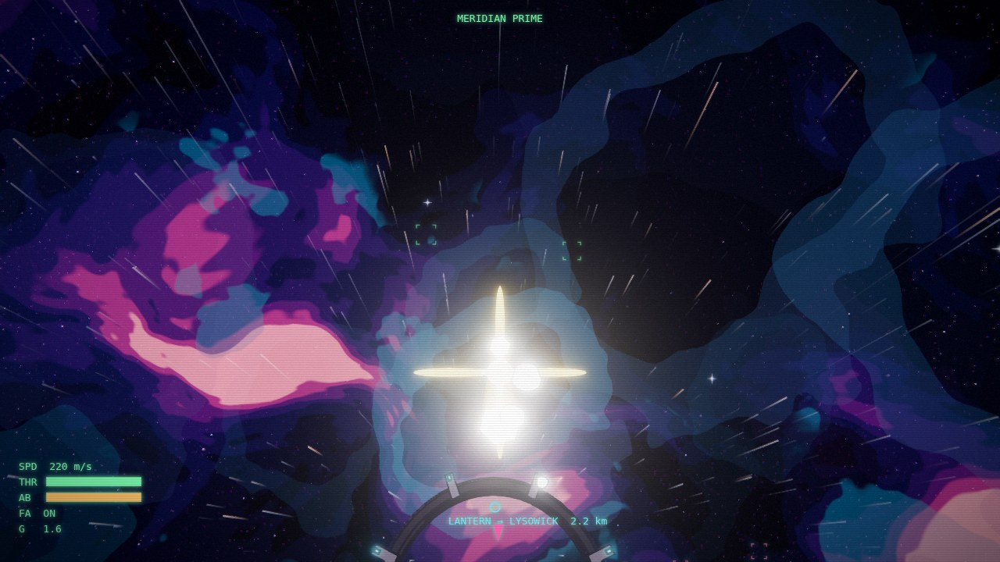
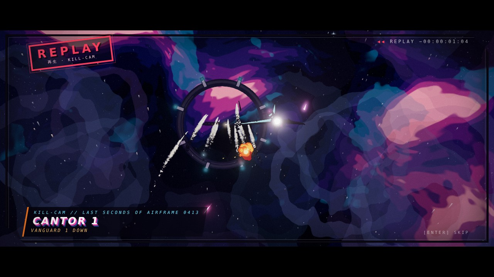
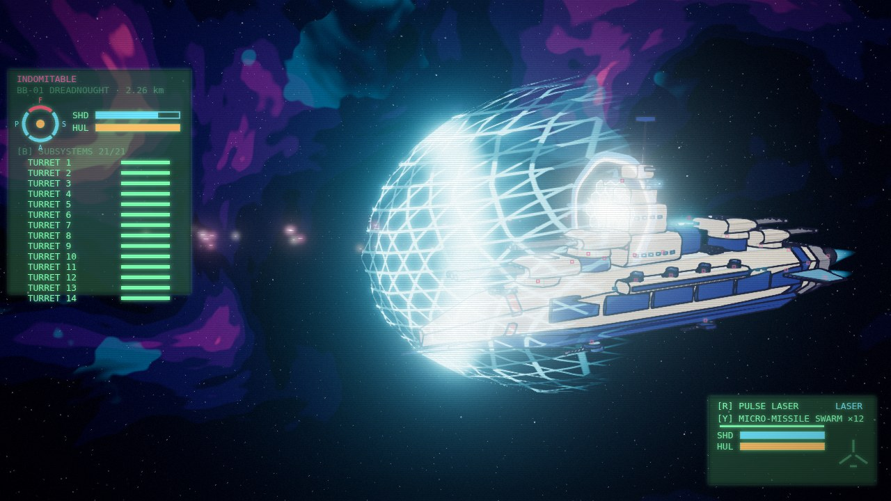

# Roadmap

Guiding rules (after Carmack): one ship flying well first; performance and
latency measured from day one with pass/fail numbers; camera-relative
rendering designed in; direct code over architecture; strict TypeScript;
lore last.

Scale rule: space is huge — lay it out in kilometres. Physics runs in
metres, but anything placed in the world (strata, belts, set pieces,
spawn rings, HUD ranges) is thought of in 1 km steps.

## Batch 1 — engine & game (first versions: all in)

| # | Milestone | Status | Where |
|---|---|---|---|
| 1 | WebGPU renderer bootstrap | ✅ | `src/render/RendererFactory.ts`, `src/core/Engine.ts` |
| 2 | Asset pipeline + cel material | ✅ | `src/assets/*`, `src/render/materials/CelMaterial.ts` |
| 3 | WGSL ink-line pass | ✅ | `src/render/post/shaders/inkEdge.wgsl.ts` |
| 4 | Flight physics, inertia, afterburner, cruise | ✅ | `src/sim/FlightModel.ts` |
| 5 | Spring chase camera, velocity zoom | ✅ | `src/sim/ChaseCamera.ts` |
| 6 | Cutaways & target-lock views | ✅ | `src/sim/CameraDirector.ts` |
| 7–9 | Fighters → carriers → dreadnoughts (11 designs, articulated) | ✅ | `src/assets/blueprints/*`, `?scene=hangar` |
| 10 | Lasers, beams, impacts, shields | ✅ | `src/sim/Weapons.ts`, `src/world/WeaponVisuals.ts` |
| 11 | Micro-missile swarms, lock HUD | ✅ | `src/sim/Missiles.ts`, `src/ui/FlightHud.ts` |
| 12 | GPU compute particles | ✅ | `src/fx/*`, `?scene=fx` |
| 13 | Wingman AI, formations, orders | ✅ | `src/sim/ai/Squadron.ts` |
| 14 | Enemy AI, maneuvers, turrets | ✅ | `src/sim/ai/*`, `npm run ai-sim` |
| 15 | Universe + star map | ✅ | `src/universe/*`, `src/ui/StarMap.ts` |
| 16 | Lantern jumps + hyperspace | ✅ | `src/world/Hyperspace.ts` |
| 17 | Tactical view + fleet command | ✅ | Tab in flight |
| 18 | Missions & objectives | ✅ | `src/game/*` |
| 19 | CRT HUD, title, briefing | ✅ | `src/ui/Screens.ts` |
| 20 | Perf: budgets, latency, dynamic resolution | ✅ (ongoing) | `src/core/Perf.ts`, `npm run perf` |

Docking & trade: seeded stations per system (refinery, salvage yard,
bastion, free port, orbital port), friendly carrier hangars, ILS approach +
auto-dock cutaway, docked market / repair / rearm / rumours, persisted
ledger (`src/game/economy.ts`, `src/world/Docking.ts`, `src/ui/DockScreen.ts`).
Hollow hangar bays with an atmosphere curtain (`src/assets/blueprints/bays.ts`,
`src/world/BayCurtain.ts`), hull collisions + AI avoidance from blueprint
proxies (`src/sim/Collision.ts`, `npm run ai-sim` station scenarios), wingmen
hold off the corridor (`src/world/WingDocking.ts`), balanced trade with
hazard premiums (`npm run econ-sim`).

Spatial depth: space dust streaks, asteroid belts, haze lanes (`?scene=spatial`),
and a **multiplane sky** — Disney's multiplane camera rebuilt for 6DOF: 16
painted cel strata, one per kilometre (`?planes=0|16|32`,
`src/world/MultiplaneSky.ts`). CPU cost is flat (p50 0.6 → 0.7 ms at 32 strata); GPU cost still to be measured on real hardware.

## Batch 2 — narrative (in progress)

Canon: the Shattering, fossil technology, Terran Directorate vs Zenith
Hegemony, the Ebon-gas monopoly, the Signal, the Builders and the
compression wave. See `docs/LORE.md` and `docs/CAMPAIGN.md`.

| Chapter | Milestones | Delivery |
|---|---|---|
| I · The Myth and the Machine | 1–5 | codex, briefings, patrol logs, environmental storytelling |
| II · The Spark and the Frying Pan | 6–10 | missions: border skirmish, black box, ghost ship, fall of the Bastion |
| III · Into the Deep Void | 11–15 | Dead Zone nebula, the Monolith, the Oracle broadcast, the schism, siege of the Nexus |
| IV · The Epic Resolution | 16–20 | solo pilgrimage, the Zenith revelation, the key, the symphony of gates, the open horizon |

Systems: data contract `src/game/campaign/types.ts`, runtime
`src/game/CampaignRunner.ts` (tested: `npm test`), radio chatter with
procedural anime portraits, codex, eyecatches, narrative set pieces.

## Batch 3 — presentation, the frontier, the shared Reach

The campaign's chapters I–IV are the first four game chapters. Batch 3
opens the Reach up around them and gets the game in front of players.

| # | Milestone | Pass/fail | Status |
|---|---|---|---|
| 1 | **Prologue** — 60 s scripted cold open: the gates, the Shattering, the Lanterns, two powers, the Signal (`?scene=prologue`) | plays at budget, skippable, first launch only (`npm run flow-check`) | ✅ |
| 2 | Cinema sequencer — timeline of shots, captions, cues (shared by prologue, cutscenes, trailer) | a shot list is data only (`src/cinema`) | ✅ |
| 3 | Attract mode / trailer — title idles into the prologue and flybys | runs unattended 10 min | 🔧 idle title → prologue reel |
| 4 | Photo mode + clip capture (headless webm/GIF from recorded input) | 1080p clip from a replay | |
| 5 | **Stations** — refineries, salvage yards, bastions, free ports, 1–3 per system | seeded, on star map | ✅ |
| 5b | **Living Reach** — painted planets (giants, terrestrial, volcanic, burning, Lantern-lit), moons, shattered moons, fly-through rings; timetable traffic, patrol wings, raider ambushes, arrivals flashes | seeded & deterministic, stations/gates untouched (`tests/reach.test.ts`) | 🔧 |
| 6 | **Docking** — request within 5 km, ILS corridor, auto-dock under 1 km, launch | hostiles within 10 km block it | ✅ |
| 7 | **Trade** — commodities, supply/demand per station, cargo, credits | pure, unit-tested economy; `npm run econ-sim` bands (safe 1.5–4k / hold, risky ≤ 9k) | ✅ |
| 8 | Repair, rearm, reputation per faction | persists in profile | ✅ |
| 9 | Planetary ports — orbital elevators / descent corridor to the surface port | seamless approach, no load screen | ✅ landing corridor → entry → cloud punch-through → local surface scene (world-root swap under the whiteout) → pad; `surface` station kind; every hull size docks (clamp gantries, moorings, carriers alongside) (`src/world/surface`, `src/world/berths`) |
| 10 | Contracts board — courier, escort, bounty jobs generated from station state | uses the campaign runner | ✅ 8 kinds, seeded boards, runner-driven ops (`src/game/contracts`) |
| 11 | Free-roam between episodes — the Reach stays open, episodes start from a station | save/resume anywhere docked | ✅ debrief → free flight → priority orders; title CONTINUE |
| 12 | Ship upgrades & hangar — guns, missiles, shields, engines; livery shop | visible on the model | ✅ |
| 13 | **MP-0 determinism** — fixed 60 Hz step, seeded RNG, sim/render split | bit-identical 10 min replay | ✅ `npm run determinism`: dogfight · capital battle · traffic ambush, 600/600 checkpoints each, recorded input replays to the bit; 0 `Math.random` in the sim |
| 14 | Replays + kill-cam from recorded input | replay matches live | ✅ always-on recorder, O saves a clip, `?replay=auto\|clip-N\|<url>` (SYNC checkpoints; `scripts/replay-check.mjs`), kill-cam on death / capital / bounty kills |
| 15 | Headless shard (Node) + bot clients | 200 ships < 8 ms tick | |
| 16 | Two-browser flight: prediction, interpolation, lag-compensated hits | < 2 m error at 150 ms RTT | |
| 17 | Lantern jump = shard handoff | < 3 s inside the tunnel | |
| 18 | Persistent economy + faction front on the star map | server-authoritative | |
| 19 | Co-op campaign (up to 4) | episodes playable with 2 | |
| 20 | Public playtest build + landing page | 100 concurrent | |

Design for 13–20: [docs/MULTIPLAYER.md](MULTIPLAYER.md) (MP-0 as built: fixed
step + render prediction, RNG streams, replay format, kill-cam, what still
couples).

## Batch 4 — the hero's career (first versions: all in)

From a borrowed Kestrel to your own frigate: earn shares and standing, refit,
buy the next hull, take on bigger adversaries.

| # | Milestone | Pass/fail | Status |
|---|---|---|---|
| 1 | Per-ship stats, faction weapon families, damage types | Kestrel vs Cantor TTK 3–8 s | ✅ |
| 2 | Locational damage: capital subsystems, fighter zones, visible damage | subsystem effects felt | ✅ |
| 3 | Directional shields, collapse/regen visuals | facings on HUD | ✅ |
| 4 | Progression line T1→T6: Kestrel → heavy fighter → gunship → corvette → frigate | each tier flyable | ✅ |
| 5 | Rustwake line, civilian freighters/tankers/liners, mid-tier warships | in hangar | ✅ |
| 6 | Shipyard + outfitting (hardpoints, shields, armour, engines, reactor) | fit changes stats & model | ✅ `src/game/outfitting`, SHIPYARD / OUTFITTING dock tabs, turrets fire, `npm run balance` *outfit* |
| 7 | Contracts board: courier, haul, escort, bounty, patrol, salvage, recon, sorties | seeded, tested | ✅ |
| 8 | Free-roam career loop between episodes | story resumes on demand | ✅ |
| 9 | Living Reach: ringed giants, moons, city lights, traffic lanes, patrols, pirates | perf budget holds | ✅ |
| 10 | People: concourse NPCs, branching dialog, rumours | ≥ 12 conversations | ✅ |
| 11 | Voices: procedural OVA voice synth (+ optional Web Speech), subtitles everywhere | < 17 chars/s | ✅ |
| 12 | Hollow hangar bays, collisions, economy rebalance | next ship in 30–60 min | ✅ |
### Combat depth ✅

| Piece | Pass/fail | Where |
|---|---|---|
| Ship stats per design (hull, shields, regen/delay, mass, agility, speed, signature) | table covers all 11 designs (`npm test`) | `src/sim/Loadouts.ts` |
| Weapon families + loadouts; R / Y cycle guns and missiles | damage-type ratios (`npm run balance`) | `Loadouts.ts`, `Weapons.ts`, `Missiles.ts` |
| Capital subsystems with effects; B sub-targets | turret to a wing of 4: 5–15 s | `src/sim/Damage.ts`, `Combat.ts`, `Capitals.ts` |
| Fighter damage zones (thrust, roll drift, smoke) | unit-tested routing | `Damage.ts`, `src/world/DamageFx.ts` |
| Directional capital shields, collapse / regen visuals | facing routing unit-tested | `WeaponVisuals.ts`, `CombatFx.ts` |
| Balance | Kestrel vs Cantor 3–8 s · capital to a squadron 60–180 s | `npm run balance` |

## Batch 5 — allegiance & a Reach that remembers (in progress)

The sandbox and the story start talking to each other. One shared memory,
`src/game/world/WorldState.ts` (facts, counters, decaying per-system/station
modifiers, an event log), is read and written by everything below.

| # | Milestone | Pass/fail | Status |
|---|---|---|---|
| 1 | Guilds: Order of the Keeping, Office of Continuity, Board of Allocation, Rustwake clans, Ascendant Houses — halls, ranks, quartermasters, guild contracts | a rank-up in ~45 min of guild work | 🔧 |
| 2 | Guild arc missions (hand-written, 3–5 per guild) and conflicting loyalties | arcs complete end to end | 🔧 |
| 3 | Outposts: restore a hulk as your guild's base | build → upgrade → defend | 🔧 |
| 4 | World state driven by story flags and player actions: prices, traffic, patrols, station attitude | effects visible within one session | 🔧 |
| 5 | The Schedule on the star map: fixed engagements to fly or break | breaking one has consequences | 🔧 |
| 6 | The Signal countdown between chapters | visible, advances with the story | 🔧 |
| 7 | Persistent NPC arcs that advance while you're away | ≥ 6 arcs | ✅ 7 arcs (Odile, Magpie, Pell, Nadia, Toma, Dalca & Pieter, Maud), 7 arc jobs, THREADS tab |
| 8 | Rivals: named aces and bounty targets that remember and escalate | ≥ 5 rivals | ✅ 6 rivals (2 can be turned), grudge meters, tiers, world-log memory in their lines |

## Known issues

- WebGL2 fallback lines are softer than the WGSL path.
- Large flat hulls (carrier deck) catch the rim light at grazing angles;
  a screen-space silhouette rim would fix it.
- SwiftShader timings are meaningless: run `npm run perf` on real hardware.
